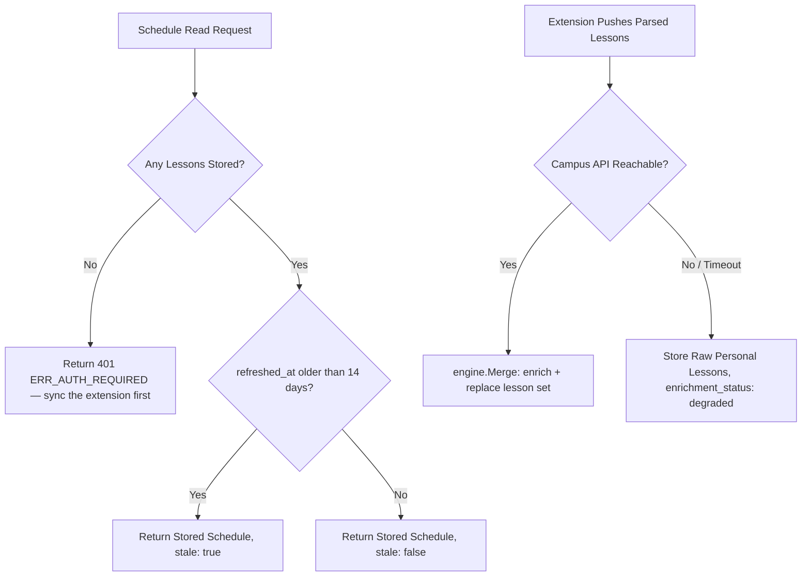

# Error Handling, Resilience & Monitoring

> **Correction (post-implementation, architecture decision).** The server no longer fetches
> or parses `my.kpi.ua` itself — the browser extension does that client-side and pushes the
> parsed schedule instead; see [`docs/architecture/data-storage.md`](data-storage.md). There
> is therefore no server-side session-expiry or DOM-parsing failure mode any more: those risks
> now live inside the extension, running in the student's own browser. §2's flowchart and §3
> below describe what the server actually still has to handle: a stale-push warning and a
> Campus API outage. `model/errors.go` was cleaned up to match — `ERR_PERSONAL_SESSION_EXPIRED`,
> `ERR_SCRAPER_DOM_CHANGED`, and `ERR_INVALID_SESSION_COOKIES` are gone.

## 1. Resilience Philosophy

The server's own failure surface is now small: it stores whatever the extension pushes, and
enriches it against `api.campus.kpi.ua`. It must stay up and keep serving the last-known-good
schedule even if the Campus API is unreachable or the extension hasn't synced recently —
neither should ever crash the server or produce an unhandled 500.

---

## 2. Failure Modes & Strategies



---

## 3. Specific Error Scenarios

### 3.1 Extension Hasn't Synced Recently
- **Symptom**: `user_schedule_state.refreshed_at` is older than 14 days (one full
  week-1/week-2 cycle plus margin).
- **Handling**: this is not an error. The stored schedule is still returned, flagged
  `stale: true`. There is no session to expire and nothing for the server to retry — the
  student (or a future reminder from the Telegram bot) just needs to open the extension
  again. See [`docs/architecture/data-storage.md`](data-storage.md) §4.

### 3.2 No Schedule Ever Pushed
- **Symptom**: a schedule read is requested for a `telegram_id` with no row in
  `user_schedule_state`.
- **Handling**: return `HTTP 401 Unauthorized` with error code `ERR_AUTH_REQUIRED`, telling
  the caller to sync the extension first.

### 3.3 Campus API Outage (`api.campus.kpi.ua`)
- **Symptom**: `api.campus.kpi.ua` times out or returns `502 / 503` while merging a freshly
  pushed lesson list.
- **Handling**:
  1. Circuit breaker pattern with 3-second timeout.
  2. Store the pushed personal lessons unenriched (the student still sees their subjects and
     timeslots, though without rich classroom links or lecturer names).
  3. Flag the stored state `enrichment_status: "degraded"`.

---

## 4. Structured Error Response Format

All API errors return consistent JSON:

```json
{
  "success": false,
  "error_code": "ERR_AUTH_REQUIRED",
  "message": "No schedule data stored yet; sync the browser extension first.",
  "timestamp": "2026-09-01T10:15:00Z"
}
```

Standard Error Codes:
- `ERR_AUTH_REQUIRED`: User not linked, or linked but no schedule has ever been pushed.
- `ERR_CAMPUS_API_UNAVAILABLE`: Public group API unreachable.
- `ERR_GROUP_NOT_FOUND`: Specified group ID does not exist in catalog.
- `ERR_USER_NOT_FOUND`: No user exists for the given `telegram_id`.
- `ERR_INVALID_REQUEST`: Malformed request (bad date format, missing required field, etc).
- `ERR_INTERNAL`: Unexpected server-side failure.
- `ERR_UNAUTHORIZED`: Missing or invalid `X-Internal-Token`.
