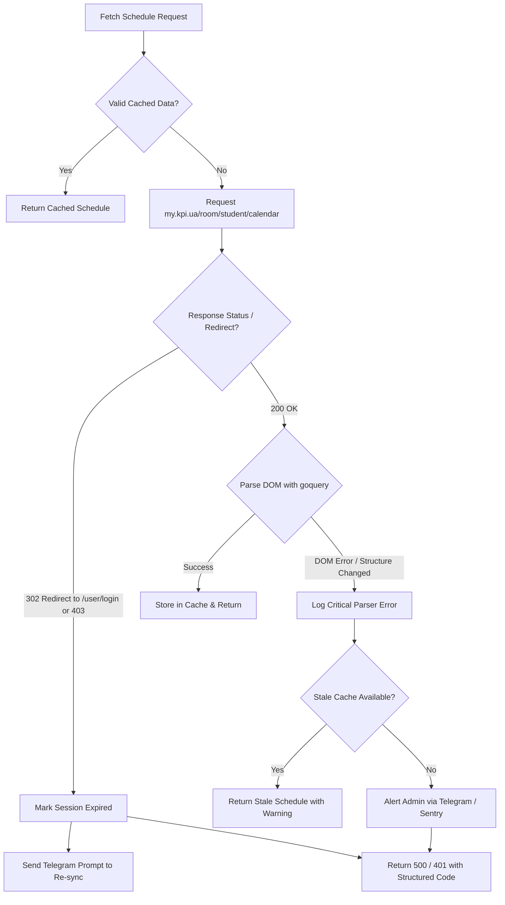

# Error Handling, Resilience & Monitoring

## 1. Resilience Philosophy

Because `my.kpi.ua` is a server-rendered web application without an official external API SLA, the scraping subsystem must be isolated and defensively engineered so that university UI changes or session expirations never crash the backend server.

---

## 2. Failure Modes & Strategies



---

## 3. Specific Error Scenarios

### 3.1 University Session Expiry (`PHPSESSID` / `_identity`)
- **Symptom**: `my.kpi.ua` returns `HTTP 302` redirecting to `https://my.kpi.ua/user/login` or `HTTP 403 Forbidden`.
- **Handling**:
  1. Catch HTTP redirect/status in Go client before following redirect loops.
  2. Set user's session status to `EXPIRED` in the database.
  3. Send an immediate push notification in Telegram:
     > ⚠️ **Сесія My KPI закінчилась**
     > Будь ласка, оновіть сесію через розширення браузера або скористайтеся командою `/link`.
  4. Return API response `HTTP 401 Unauthorized` with error code `AUTH_EXPIRED`.

### 3.2 DOM / HTML Structure Alteration
- **Symptom**: `my.kpi.ua` updates its layout (e.g. changes table classes or element IDs), causing `goquery` to find 0 lesson nodes.
- **Handling**:
  1. Validate minimum expected structure: if 0 days or 0 lessons are parsed for an active student, treat as `PARSER_STRUCTURE_MISMATCH`.
  2. Fall back to **Stale-While-Revalidate**: Serve the latest cached schedule snapshot from the database with a disclaimer badge (`[Збережена копія]`).
  3. Emit structured error log with full HTML body dumped to a diagnostic log directory.
  4. Trigger an immediate administrative alert to the bot maintainer.
  5. If no stale cache exists, return `HTTP 500 Internal Server Error` with code `SCRAPER_DOM_CHANGED`.

### 3.3 Campus API Outage (`api.campus.kpi.ua`)
- **Symptom**: `api.campus.kpi.ua` times out or returns `502 / 503`.
- **Handling**:
  1. Circuit breaker pattern with 3-second timeout.
  2. Serve the parsed personal schedule without group enrichment (the student still sees their subjects and timeslots, though without rich classroom links).
  3. Return schedule with `enrichment_status: "degraded"`.

---

## 4. Structured Error Response Format

All API errors return consistent JSON:

```json
{
  "success": false,
  "error_code": "ERR_PERSONAL_SESSION_EXPIRED",
  "message": "The session for my.kpi.ua has expired. Please re-authenticate via browser extension.",
  "timestamp": "2026-09-01T10:15:00Z"
}
```

Standard Error Codes:
- `ERR_AUTH_REQUIRED`: User not linked to any account.
- `ERR_PERSONAL_SESSION_EXPIRED`: `my.kpi.ua` session expired.
- `ERR_SCRAPER_DOM_CHANGED`: `my.kpi.ua` HTML structure cannot be parsed.
- `ERR_CAMPUS_API_UNAVAILABLE`: Public group API unreachable.
- `ERR_GROUP_NOT_FOUND`: Specified group ID does not exist in catalog.
