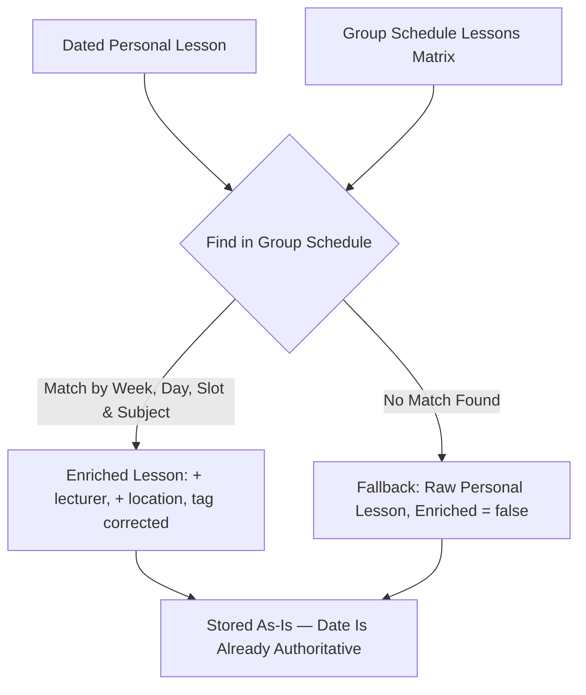

# Schedule Merging & Enrichment Engine

> **Correction (post-implementation).** This document originally assumed the personal
> schedule (`my.kpi.ua`) was a recurring week-1/week-2 matrix, like the group schedule, and
> that occurrence dates needed resolving from the Campus API's `dates[]` on every read. Real
> testing showed the personal feed already returns concrete, exact-dated lesson
> occurrences — see [`docs/schedules/main/data-extraction.md`](../schedules/main/data-extraction.md).
> §3 ("Date Filtering") and §6 ("Read-Time Staleness Guard") below describe the **original,
> now-obsolete** design and are kept only as a record of what changed and why; the engine no
> longer does either. The rest of this document (matching by week/day/subject, the Selective
> Left Join, discarding group-only lessons) is unchanged and current.
>
> **Second correction (architecture decision).** The server no longer fetches the personal
> schedule from `my.kpi.ua` itself at all — see
> [`docs/architecture/data-storage.md`](data-storage.md). A browser extension will do that
> client-side and push the parsed lesson list to the server instead. This document's merging
> algorithm is **unaffected**: it only cares about the shape of the input (a list of dated
> personal lessons — now `model.ParsedLesson`, moved out of the removed `internal/mykpi`
> package) and runs the same way regardless of where that input came from. Everywhere below
> that said "refresh time" now means "whenever the extension's push is processed" — the
> ingestion endpoint that will call `engine.Merge` isn't built yet, so today this logic is
> exercised only by `apps/server/internal/engine/merge_test.go`.

## 1. The Problem: Discrepancies Across Schedules

KPI students face a disjointed scheduling reality:

| Metric | Personal Schedule (`my.kpi.ua`) | Group Schedule (`api.campus.kpi.ua`) |
| :--- | :--- | :--- |
| **Authentication** | Required (Yii2 session cookies) — handled entirely client-side by the browser extension; the server never sees them | Public (no auth) |
| **Format** | FullCalendar JSON feed (two-step: HTML shell → JSON events), extracted by the extension and pushed to the server as parsed lessons | Structured REST JSON, fetched directly by the server |
| **Course Scope** | **Personalized**: Only selected electives & subgroups, already exact-dated | **All Group Courses**: Includes unselected electives & foreign subgroups, week-1/week-2 pattern |
| **Classrooms** | Plain-text fallback (`locationPDF`) | Rich object: `title` ("5-306") and `uri` ("https://kpi.ua/k-5") |
| **Lecturers** | Plain-text (`descriptionRAW`) | Detailed object: `id` and `name` |
| **Occurrence Dates** | Exact — each event's own `start` date | Pattern-based: specific ISO dates list `dates: ["2026-09-07", ...]`, or every cycle of a week if empty |

---

## 2. Merging Algorithm

The engine performs a **Selective Left Join** where the Personal Schedule serves as the base source of truth for *enrollment and dates*, and the Group Schedule serves as the metadata provider for *enrichment* (lecturer, location, and tag correction) only.

A group Pair with no matching personal lesson never enters this flow at all — see §5.

---

## 3. Detailed Matching Steps

### Step 1: Time & Matrix Alignment
Each personal lesson's own `Date` is converted into the same 2D coordinate space the group
schedule uses, so the two can be matched:
- **Week**: derived via `engine.WeekAt(referenceDate, referenceWeek, lesson.Date)`, anchored
  on the Campus API's `/time/current` at the time the lesson list is merged.
- **Day**: derived via `engine.ISODay(lesson.Date)` — `1` (Monday) .. `7` (Sunday).
- **Slot Index**: resolved from the lesson's own `StartTime` against Campus's official
  lesson-slot times (`engine.slotByTime`) — Pair 1 (`08:30`) .. Pair 7 (`20:00`).

### Step 2: Subject String Normalization
Subject names often differ slightly between systems (e.g. trailing spaces, Roman vs Arabic numerals, abbreviations):
1. **Clean**: Convert to lower case, replace `’` with `'`, trim punctuation and double spaces (`engine.NormalizeSubject`).
2. **Normalize Types**: my.kpi.ua's own type codes (`lec`, `prc`, `lab`) map to the Campus tag vocabulary (`lec`, `prac`, `lab`) — note `"prc"→"prac"`, the two sources use different short codes for practicals. This mapping used to live in the (now-removed) `internal/mykpi` package; whatever implements the extension's client-side parsing needs to reproduce it, since `model.ParsedLesson.Tag` is expected to already be Campus-vocabulary by the time it reaches `engine.Merge`.
3. **Fuzzy Scoring**: Use Jaro-Winkler similarity (threshold $\ge 0.85$) if an exact normalized-name match is not found (`engine.jaroWinkler`).

### ~~Step 3: Date Filtering~~ (obsolete)

The original design filtered lessons by checking the target date against the Campus API's
`dates[]` array. This is no longer needed: since the personal source already carries an
exact `Date` per lesson, that date *is* the answer — there is nothing left to resolve. A
day/week read is a direct query on the stored `date` column
(`apps/server/internal/storage/lessons.go`, `GetLessonsByDateRange`).

---

## 4. Fallback Handling

If the Campus API is unreachable or the student belongs to a group whose schedule is not populated:
- The system stores the raw personal lessons as submitted by the extension, unenriched.
- The response is flagged `enrichment_status: "degraded"`.
- No fatal crash occurs.

## 5. Discarding Group-Only Lessons

A group Pair with no matching personal lesson (same week, day, slot, and normalized subject)
is **discarded** — it is never stored and never shown. This is what keeps electives the
student didn't choose, and the alternate subgroup's lab session, out of their feed. See
`apps/server/internal/engine/merge.go` (`Merge`), covered by
`TestMergeDiscardsGroupOnlyLessons`.

## 6. Recurring vs. Specific-Dates Lessons (`IsRecurring`)

A stored lesson's own `Date` answers "does this occur on this specific day" (§3, Step 1) —
but the generic `/schedule/week` view (a template of "what does week 1 / week 2 look like")
needs a different question answered: "does this lesson happen on **every** week of this
parity, or only on a handful of specific calendar dates?" That distinction only exists on
the Campus API side (`campus.Pair.Dates`) — my.kpi.ua's personal feed has no equivalent
concept, since it just hands back one already-dated row per actual occurrence.

`Merge` sets `MergedLesson.IsRecurring` from the matched group Pair:
- **Matched, `Dates` empty** → `IsRecurring = true` (occurs every cycle of that week).
- **Matched, `Dates` non-empty** → `IsRecurring = false` (an irregular, few-times-a-semester
  session — e.g. an exam-prep block).
- **Unmatched** (no group counterpart found) → defaults `true`; there's no group-side signal
  to say otherwise, and this preserves the pre-`IsRecurring` behavior for unenriched lessons.

`buildWeek` (`apps/server/internal/api/schedule_service.go`) uses this to build the
template: it scans a multi-week window of stored rows, **excludes** `IsRecurring = false`
lessons entirely (they only ever show up via `/today`, `/tomorrow`, or `/date`, which read
the exact stored `date` directly — never as a phantom "every week" fixture), and **dedupes**
`IsRecurring = true` lessons down to one representative per (day, start_time, subject) —
since a genuinely recurring class has one stored row per real occurrence within the scan
window, and the template should show it once per week-slot, not once per occurrence.

## 7. ~~Read-Time Staleness Guard~~ (obsolete)

The original design re-fetched the group schedule on every read to re-derive `dates[]` live,
in case the Campus API's pattern-based dates had shifted between refreshes. This mechanism
existed only to answer "does this pattern-based lesson occur on this specific date?" — a
question the personal source's own `Date` field now answers directly, at merge time, with no
live re-derivation needed. See [`docs/architecture/data-storage.md`](data-storage.md) §4 for
the full rationale and the sync-time enrichment flow that replaced it.
