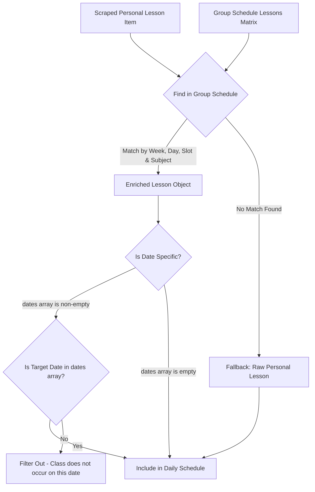

# Schedule Merging & Enrichment Engine

## 1. The Problem: Discrepancies Across Schedules

KPI students face a disjointed scheduling reality:

| Metric | Personal Schedule (`my.kpi.ua`) | Group Schedule (`api.campus.kpi.ua`) |
| :--- | :--- | :--- |
| **Authentication** | Required (Yii2 session cookies) | Public (no auth) |
| **Format** | Server-rendered HTML | Structured REST JSON |
| **Course Scope** | **Personalized**: Only selected electives & subgroups | **All Group Courses**: Includes unselected electives & foreign subgroups |
| **Classrooms** | Often omitted or basic text | Rich object: `title` ("5-306") and `uri` ("https://kpi.ua/k-5") |
| **Lecturers** | Basic text | Detailed object: `id` and `name` |
| **Occurrence Dates** | Weekly matrix only | Specific ISO dates list: `dates: ["2026-09-07", ...]` |

---

## 2. Merging Algorithm

The engine performs a **Selective Left Join** where the Personal Schedule serves as the base source of truth for *enrollment*, and the Group Schedule serves as the metadata provider for *enrichment*.



---

## 3. Detailed Matching Steps

### Step 1: Time & Matrix Alignment
Group both personal and group schedules into a normalized 2D coordinate space:
- **Week**: `Week 1` (Odd) or `Week 2` (Even).
- **Day**: `Monday` (Пн), `Tuesday` (Вв), `Wednesday` (Ср), `Thursday` (Чт), `Friday` (Пт), `Saturday` (Сб).
- **Slot Index**: Pair 1 (`08:30`), Pair 2 (`10:25`), Pair 3 (`12:20`), Pair 4 (`14:15`), Pair 5 (`16:10`), Pair 6 (`18:05`), Pair 7 (`20:00`).

### Step 2: Subject String Normalization
Subject names often differ slightly between systems (e.g. trailing spaces, Roman vs Arabic numerals, abbreviations):
1. **Clean**: Convert to lower case, replace `’` with `'`, trim punctuation and double spaces.
2. **Normalize Types**: Map `(Лек)`, `(Прак)`, `(Лаб)` into standard tags: `lec`, `prac`, `lab`.
3. **Fuzzy Scoring**: Use Levenshtein similarity or Jaro-Winkler distance (threshold $\ge 0.85$) if exact substring match is not found.

### Step 3: Date Filtering
A critical feature of the Campus API is the `dates` array:
```json
{
  "name": "Основи розробки трансляторів",
  "type": "Прак",
  "dates": [
    "2026-09-07",
    "2026-09-21",
    "2026-10-05",
    "2026-10-19",
    "2026-11-02",
    "2026-11-16"
  ]
}
```
- **Rule**: If `len(dates) > 0`, the class **only occurs on the specified calendar dates**.
- When generating `/today`, `/tomorrow`, or a specific calendar date schedule, the engine checks whether the target date (`YYYY-MM-DD`) is in `dates`. If not, the class is discarded for that day.
- When generating generic `/week` views, the engine displays the schedule with an indicator badge (e.g. `[Певні дати: 07.09, 21.09...]`).

---

## 4. Fallback Handling

If the Campus API is unreachable or the student belongs to a group whose schedule is not populated:
- The system returns the raw scraped personal schedule from `my.kpi.ua`.
- An indicator informs the user: *"Відображено базовий розклад без розширених даних про аудиторії"*.
- No fatal crash occurs.
