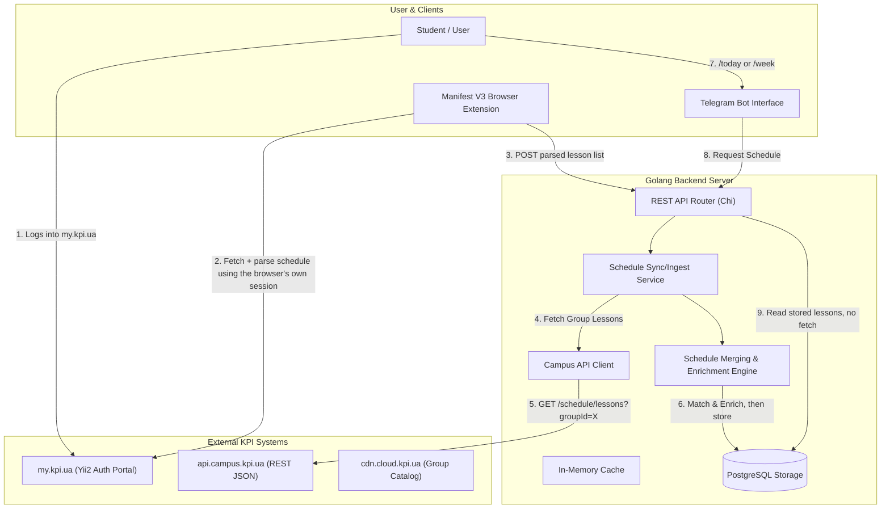

# System Architecture Overview

> **Correction (post-implementation, architecture decision).** The flow below reflects the
> current decision: the browser extension does the my.kpi.ua fetch **and** parse itself,
> client-side, and pushes the finished schedule to the server. The server never receives or
> stores `my.kpi.ua` credentials, and no longer runs a scraper of its own — see
> [`docs/architecture/data-storage.md`](data-storage.md) for the rationale. The extension and
> its server-side ingestion endpoint are **not built yet**; this document describes the
> target shape.

## 1. High-Level Concept

The KPI Personalized Schedule platform bridges two distinct data sources to deliver an accurate, noise-free timetable for university students:

1. **Personalized Schedule (`my.kpi.ua`)**:
   - Contains only the exact elective courses and subgroup sessions chosen by the authenticated student.
   - Lacks rich details like teacher IDs and classroom map links.
   - Protected behind session-based authentication (Yii2 PHP / `PHPSESSID` / `_identity`) — handled entirely inside the student's own browser by the extension; the server is never involved in authenticating to `my.kpi.ua`.

2. **Group Schedule (`api.campus.kpi.ua`)**:
   - Open and publicly accessible REST API for the entire academic group.
   - Contains rich metadata: classroom building/room (`location.title`, `location.uri`), lecturer names/IDs, lesson tags (`lec`, `prac`, `lab`), and exact calendar occurrence dates (`dates: ["YYYY-MM-DD", ...]`).
   - Contains redundant classes (all electives and alternate subgroups that the student might not attend).

The system continuously pairs personal enrollment data with public group metadata, filters out unwanted classes, and surfaces a clean schedule via Telegram.

---

## 2. End-to-End System Flow

---

## 3. Core Architectural Components

### 3.1 Browser Extension (`apps/extension/`)
- **Role**: The only part of the system that ever touches `my.kpi.ua` credentials. Fetches and parses the student's schedule client-side, in their own authenticated browser session, and pushes the result to the server. Nothing resembling a cookie ever leaves the browser.
- **Workflow** (target, not yet built):
  1. Student logs into `my.kpi.ua` via browser (supporting password or KPI ID / Diia / BankID SSO).
  2. Student requests a pairing code from the Telegram bot (`/link`), or the extension is configured directly with their Telegram ID (exact pairing UX still to be designed).
  3. Extension fetches the calendar shell page and the FullCalendar events JSON using the browser's own cookies (replicating what `docs/schedules/main/data-extraction.md` documents), parses it into the `model.ParsedLesson` shape, and POSTs the parsed list to the backend.

### 3.2 Golang Backend API (`apps/server/internal/`)
- **Campus API Client (`apps/server/internal/campus/`)**: Queries `https://api.campus.kpi.ua/` for group schedules, current academic week, timeslots, and group lists.
- **Merging Engine (`apps/server/internal/engine/`)**: Matches each submitted personal lesson against the corresponding group lesson object from the Campus API, adding classroom/lecturer info and correcting tags. No longer does any date filtering — the personal source's own dates are already authoritative (see `docs/architecture/merging-engine.md`).
- **Cache Layer (`apps/server/internal/cache/`)**: Caches group schedules (TTL 24h) and catalog/slot data (TTL 24h) to avoid rate limits.
- There is no scraper package any more — `internal/mykpi` (the my.kpi.ua HTTP client/parser) was removed along with `internal/crypto` (cookie encryption) when this decision was made. The schedule-sync ingestion endpoint that will receive the extension's push is not implemented yet.

### 3.3 Telegram Bot (`apps/server/internal/bot/`)
- **Role**: Primary UI for students to check daily/weekly schedules, customize reminders, and manage group bindings.
- **Features**:
  - Daily schedule (`/today`, `/tomorrow`) with classroom locations and direct links.
  - Weekly schedule (`/week1`, `/week2`, `/week`).
  - Automated morning reminders before the first class of the day.
  - Alerts if the extension hasn't synced in a while (there is no "session" to expire any more — see `docs/architecture/data-storage.md` §4).
