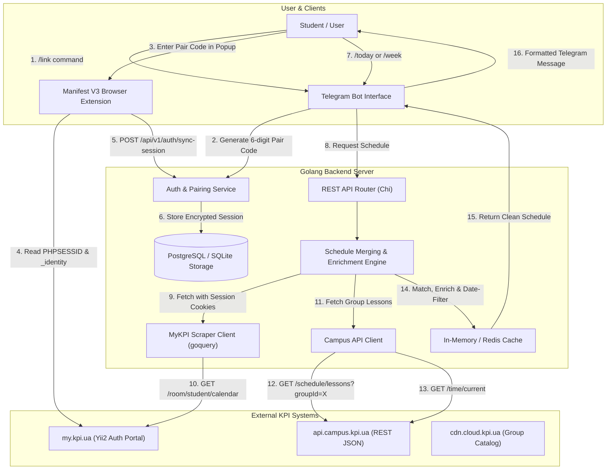

# System Architecture Overview

## 1. High-Level Concept

The KPI Personalized Schedule platform bridges two distinct data sources to deliver an accurate, noise-free timetable for university students:

1. **Personalized Schedule (`my.kpi.ua`)**:
   - Contains only the exact elective courses and subgroup sessions chosen by the authenticated student.
   - Lacks rich details like teacher IDs, classroom map links, and exact bi-weekly/periodic dates.
   - Protected behind session-based authentication (Yii2 PHP / `PHPSESSID` / `_identity`).

2. **Group Schedule (`api.campus.kpi.ua`)**:
   - Open and publicly accessible REST API for the entire academic group.
   - Contains rich metadata: classroom building/room (`location.title`, `location.uri`), lecturer names/IDs, lesson tags (`lec`, `prac`, `lab`), and exact calendar occurrence dates (`dates: ["YYYY-MM-DD", ...]`).
   - Contains redundant classes (all electives and alternate subgroups that the student might not attend).

The system continuously pairs personal enrollment data with public group metadata, filters out unwanted classes, and surfaces a clean schedule via Telegram.

---

## 2. End-to-End System Flow

---

## 3. Core Architectural Components

### 3.1 Browser Extension (`extension/`)
- **Role**: Secure bridge between the student's authenticated browser session and the Go backend.
- **Workflow**:
  1. Student logs into `my.kpi.ua` via browser (supporting password or KPI ID / Diia / BankID SSO).
  2. Student requests a pairing code from the Telegram bot (`/link`).
  3. Student opens the extension popup, enters the code, and clicks **"Sync Schedule"**.
  4. Extension reads `my.kpi.ua` session cookies (`PHPSESSID`, `_identity`) and sends them over HTTPS to the backend.

### 3.2 Golang Backend API (`internal/api/` & `internal/engine/`)
- **Scraper Service (`internal/mykpi/`)**: Makes authenticated HTTP requests to `https://my.kpi.ua/room/student/calendar` using the stored session cookies, parsing HTML tables to extract enrolled classes, days, and timeslots.
- **Campus API Client (`internal/campus/`)**: Queries `https://api.campus.kpi.ua/` for group schedules, current academic week, timeslots, and group lists.
- **Merging Engine (`internal/engine/`)**: Matches each enrolled class from the scraper with the corresponding group lesson object from the Campus API, applying date filtering and adding classroom/teacher info.
- **Cache Layer (`internal/cache/`)**: Caches group schedules (TTL 24h) and user personalized schedules (TTL 1-6h) to avoid rate limits and reduce scraping latency.

### 3.3 Telegram Bot (`internal/bot/`)
- **Role**: Primary UI for students to check daily/weekly schedules, customize reminders, and manage group bindings.
- **Features**:
  - Daily schedule (`/today`, `/tomorrow`) with classroom locations and direct links.
  - Weekly schedule (`/week1`, `/week2`, `/week`).
  - Automated morning reminders before the first class of the day.
  - Session status monitoring with alerts if the university session expires.
