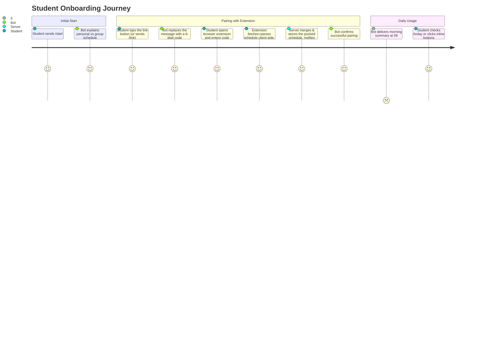

# Telegram Bot Architecture & User Experience

> **Runtime note.** The bot is **not a separate service**. It runs inside the single Go backend (`apps/server/internal/bot/`, using `gotgbot/v2`) and shares its process, database, cache, and scheduler. It calls `internal/api.Service` and `internal/storage.DB` directly, in-process — not over HTTP with `X-Internal-Token`, even though the `/api/v1/auth/pair/generate` and `/api/v1/schedule/*` endpoints exist and are internal-token-protected for other internal/admin callers. Updates arrive via webhook (`POST /api/v1/telegram/webhook`) in production (**not implemented yet** — needs its own per-Telegram-user rate limiting, see `docs/architecture/error-handling-resilience.md` §5) and via long polling in local development (implemented). See [`docs/project-repository.md` §4.1](../project-repository.md) for the rationale.
>
> **Implementation status.** `/start`, `/link`, `/today`, and `/week` are implemented, all four as button screens that edit the message in place. `/tomorrow`, `/group`, `/settings`, `/help`, morning reminders, and the stale-schedule background check are **not implemented yet** — see §6.

## 1. Bot Purpose & Features

The Telegram Bot provides students with quick, frictionless access to their verified daily and weekly schedules. It combines:
- **Interactive Inline Buttons**: Seamless switching between Days, Weeks, and Disciplines.
- **Smart Enrichments**: Direct links to campus buildings/rooms (`https://kpi.ua/k-5`) and lecturer profiles.
- **Morning Briefings**: Configurable automated reminders before the first class of the day.
- **Stale Schedule Alerts**: Notification if the browser extension hasn't pushed an update in a while — there is no server-side session to expire any more, see [`docs/architecture/data-storage.md`](../architecture/data-storage.md) §4.

---

## 2. Command Reference

| Command | Status | Action Description |
| :--- | :--- | :--- |
| `/start` | ✅ Implemented | Onboarding screen: extension prerequisite + a button that swaps the message over to the pairing code; notes an existing sync and offers a direct schedule button when one is fresh (see §3.3). |
| `/link` | ✅ Implemented | Generates a 6-digit one-time code for Browser Extension pairing — the same screen the `/start` button leads to. |
| `/today` | ✅ Implemented | Shows today's classes with locations and teacher names, with ◀️ Вчора / 📅 Сьогодні / Завтра ▶️ inline day-navigation. |
| `/week` | ✅ Implemented | Shows one academic week compactly, with previous/current/next week slots and a jump to today (see §3.2). |
| `/tomorrow` | Not yet built | Shows tomorrow's classes. |
| `/group` | Not yet built | Set or change the academic group (e.g. `ІП-21`). |
| `/settings` | Not yet built | Manage morning reminders, timezone, and account linking status. |
| `/help` | Not yet built | FAQ, troubleshooting, and links to web extension. |

---

## 3. Message Layout Examples

### 3.1 Daily Schedule View (`/today`)

```text
📅 Розклад на сьогодні (Вівторок, 1 вересня)
🔹 1-й тиждень (Чисельник) | Група: ІП-21

1️⃣ 08:30 — 10:05 | Лекція
📖 Процеси розробки вбудованого ПЗ
👨‍🏫 Гуменний Д. О.
📍 Аудиторія: 18-402 (Корпус 18)

2️⃣ 10:25 — 12:00 | Практика [Вибіркова]
📖 Технології DevOps
👨‍🏫 Колумбет В. П.
📍 Аудиторія: 5-508 (Корпус 5)

[ ◀️ Вчора ]  [ 📅 Сьогодні ]  [ Завтра ▶️ ]
```

The middle button jumps back to the current day from wherever navigation has wandered
to. There is no separate "refresh" button: every render re-reads storage, so the data is
always fresh — tapping 📅 Сьогодні while already on today is the refresh.

### 3.2 Weekly Schedule View (`/week`)

One academic week at a time, deliberately compact (one line per lesson — a full per-lesson
block for six days would not fit a Telegram message):

```text
🗓 Перший тиждень (Чисельник) — Поточний
🔹 Група: ІП-21

Понеділок
10:25 Практичний курс іноземної мови. Частина 1 (лек.)
12:20 Компоненти програмної інженерії. Частина 4 (лек.)

Середа — Сьогодні
08:30 Процеси розробки вбудованого ПЗ (прак.)
16:10 Основи розробки трансляторів (прак.)

[ ◀️ Минулий ]  [ ✅ Поточний ]  [ Наступний ▶️ ]
[ 📅 Розклад на сьогодні ]
```

The three week buttons are **fixed slots** relative to the real current week (offsets −1,
0, +1), not steps relative to what is on screen — so navigation never drifts further than
one week out from today. Telegram has no disabled-button state, so the slot currently being
displayed renders as a marked, inert button (`✅ …`, callback `week:noop`) instead of being
removed, keeping the row's shape stable. Days are marked *Сьогодні*/*Завтра* only in the
current week (offset 0), where those labels can actually apply.

### 3.3 Onboarding screens (`/start` → `/link`)

Two screens inside a single message, edited in place:

```text
👋 Вітаю! …
Спочатку встанови браузерне розширення — інструкція буде тут пізніше.   ← placeholder
✅ Твій розклад уже синхронізовано …                                     ← only if synced
[ 🔗 Прив'язати акаунт ]
[ 📅 Розклад на сьогодні ]                                               ← only if fresh

        ↓ (same message, edited)

🔑 Код прив'язки: 123-456 …
[ ◀️ Назад ]  [ 🗓 Показати розклад ]
```

`◀️ Назад` returns to the start screen; `🗓 Показати розклад` moves forward into the `/week`
view. The schedule screens (§3.1, §3.2) deliberately have **no route back** to onboarding —
it is a one-way path.

The start screen is **state-aware** (`Service.ScheduleFreshness`, no network calls), but only
additively — the onboarding text and the link button are present in every state, so
re-pairing is always possible:

| State | Extra note | Extra button |
| :--- | :--- | :--- |
| No schedule pushed yet | — | — |
| Pushed, but stale | ⚠️ synced, but may be outdated — sync again | — |
| Pushed and fresh | ✅ already synced | `📅 Розклад на сьогодні` |

`◀️ Назад` re-evaluates this state rather than restoring a snapshot, so a student who pairs
the extension in another tab and then goes back sees the updated screen.

---

## 4. Onboarding User Journey



---

## 5. Inline Navigation & Message Mutation

Every button in the bot — onboarding, day navigation, week navigation — **edits the existing message in place** rather than sending a new one, so the chat is never flooded. Only typed commands (`/start`, `/link`, `/today`, `/week`) post a new message, since there is nothing on screen to edit yet. This uses:

| Purpose | Bot API method |
| :--- | :--- |
| Replace the schedule text and buttons | `editMessageText` |
| Replace only the keyboard | `editMessageReplyMarkup` |
| Remove a message | `deleteMessage` |
| Stop the button's loading spinner | `answerCallbackQuery` |

Each screen namespaces its buttons with its own `callback_data` prefix — `menu:` (onboarding), `nav:` (day), `week:` (week) — so one dispatcher handler is registered per screen instead of one that demultiplexes every button in the bot.

**Storage implication**: a callback update already carries `callback_query.message.message_id` and the chat ID, so ordinary navigation requires **no persisted message state**. A `message_id` only needs to be stored when the server must edit a message *later and unprompted* — for example, amending the morning briefing if a class is cancelled.

---

## 6. Automated Background Worker

> **Not implemented yet.** `apps/server/internal/scheduler/` does not exist yet, and there is
> no DB table backing per-user reminder settings or an outbox of due reminders either. The
> design below is the target shape.

The server runs an in-process scheduler (`apps/server/internal/scheduler/`):
- **Morning Reminder Worker**: Fires every morning (e.g. at 07:30 or 08:00) for opted-in users who have classes scheduled on that day.
- **Stale Schedule Check Worker**: Periodically checks `user_schedule_state.refreshed_at` and alerts users gracefully to re-sync the extension if it's gone stale (see [`docs/architecture/data-storage.md`](../architecture/data-storage.md) §4) — there are no session cookies to validate any more, only a push timestamp to watch.

Per-user reminders are **not** individual cron entries. A single short-interval tick drains a table of due reminders (outbox pattern), so pending notifications survive restarts and redeploys.

Sending a reminder is a plain outbound HTTPS call to `api.telegram.org`, independent of whether updates are delivered by webhook or long polling.
