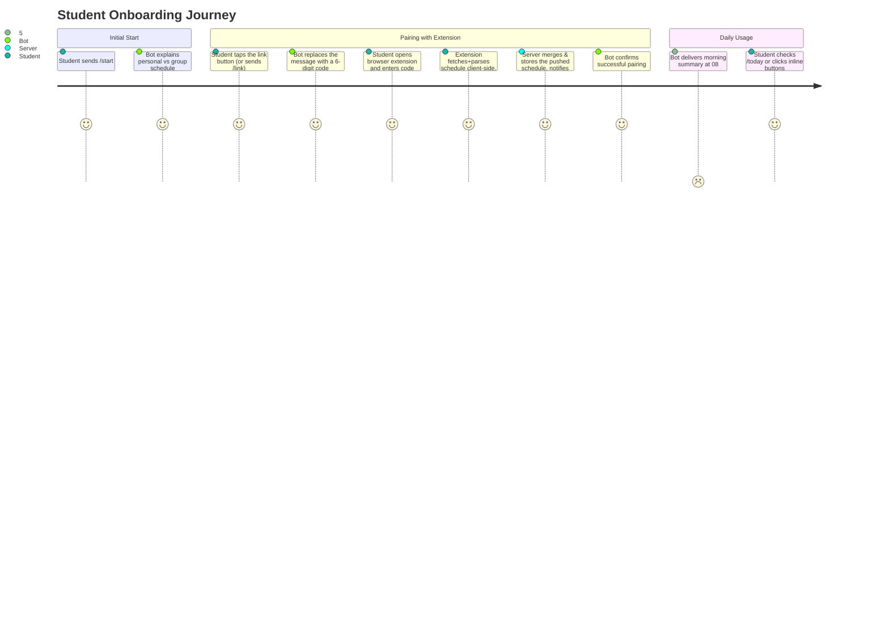

# Telegram Bot Architecture & User Experience

> **Runtime note.** The bot is **not a separate service**. It runs inside the single Go backend (`apps/server/internal/bot/`, using `gotgbot/v2`) and shares its process, database, cache, and scheduler. It calls `internal/api.Service` and `internal/storage.DB` directly, in-process — not over HTTP with `X-Internal-Token`, even though the `/api/v1/auth/pair/generate` and `/api/v1/schedule/*` endpoints exist and are internal-token-protected for other internal/admin callers. Updates arrive via webhook (`POST /api/v1/telegram/webhook`), authenticated by `secret_token` via the `X-Telegram-Bot-Api-Secret-Token` header and exempt from IP rate limiting (see `docs/architecture/error-handling-resilience.md` §5). Both local development (via ngrok/tunnel) and production use webhooks — no long polling is used. See [`docs/project-repository.md` §4.1](../project-repository.md) for the rationale.
>
> **Implementation status.** `/start`, `/install`, `/link`, `/today`, `/tomorrow`, `/week`, `/urls`, `/group`, `/group_today`, `/group_tomorrow`, `/group_week`, and `/settings` are implemented. `/help`, morning reminders, and the stale-schedule background check are **not implemented yet** — see §6.

## 1. Bot Purpose & Features

The Telegram Bot provides students with quick, frictionless access to their verified daily and weekly schedules. It combines:
- **Interactive Inline Buttons**: Seamless switching between Days, Weeks, and Disciplines.
- **Group Chat Integration**: Adding the bot to academic group chats with dedicated group schedules and caller attribution.
- **Smart Enrichments**: Direct links to campus buildings/rooms (`https://kpi.ua/k-5`) and lecturer profiles.
- **Automated Lesson Alerts**: Configurable reminders 10 minutes before and at the start of classes for students and groups.
- **Stale Schedule Alerts**: Notification if the browser extension hasn't pushed an update in a while — there is no server-side session to expire any more, see [`docs/architecture/data-storage.md`](../architecture/data-storage.md) §4.

---

## 2. Command Reference

Commands are scoped via Telegram's `setMyCommands` API (`BotCommandScopeAllPrivateChats` and `BotCommandScopeAllGroupChats`). If a scoped command is invoked in the wrong chat type, a clear Ukrainian error notice is returned, `/issues` included (see [issues.md](issues.md)).

| Command | Scope | Menu Description | Status | Action Description |
| :--- | :--- | :--- | :--- | :--- |
| `/start` | DM / Groups | `Знайомство та головне меню` | ✅ Implemented | In DMs: onboarding screen or deep-link router (`bind_<chatID>`, `cfg_<groupID>`). In groups: introduces the bot and explains available commands. |
| `/install` | DM only | `Інструкція та встановлення розширення` | ✅ Implemented | Shows step-by-step developer mode installation guide and button linking to external extension package or marketplace (`EXTENSION_INSTALL_URL`). |
| `/link` | DM only | `Отримати код прив'язки браузерного розширення` | ✅ Implemented | Generates a 6-digit one-time code for Browser Extension pairing. |
| `/urls` | DM only | `Посилання на онлайн-заняття` | ✅ Implemented | Interactive menu to manage custom lesson conference URLs (Zoom, Meet, etc.) with prompt-and-delete chat flow (see §3.4). |
| `/today` | DM & Groups | DM: `Показати розклад на сьогодні`<br>Group: `Показати персональний розклад на сьогодні` | ✅ Implemented | Shows today's personal classes. In groups, prepends `👤 Розклад: <Користувач>` attributing who last triggered or navigated the schedule (see §3.5). |
| `/tomorrow` | DM & Groups | DM: `Показати розклад на завтра`<br>Group: `Показати персональний розклад на завтра` | ✅ Implemented | Shows tomorrow's personal classes. In groups, carries caller attribution (see §3.5). |
| `/week` | DM & Groups | DM: `Показати розклад на тиждень`<br>Group: `Показати персональний розклад на тиждень` | ✅ Implemented | Shows one academic week compactly. In groups, also carries caller attribution (see §3.5). |
| `/group` | Chat Admins & DM | `Керування академічною групою` | ✅ Implemented | In DMs: interactive group management menu (create, view, edit academic group, unbind, delete, toggle notifications, manage admins). In groups: registered exclusively under `BotCommandScopeAllChatAdministrators` (invisible to regular members), providing secure callback buttons to configure in DM. |
| `/group_today` (`/group-today`) | Groups only | `Показати розклад групи на сьогодні` | ✅ Implemented | Shows today's overall group schedule fetched directly from the secondary Campus API (`api.campus.kpi.ua`). |
| `/group_tomorrow` (`/group-tomorrow`) | Groups only | `Показати розклад групи на завтра` | ✅ Implemented | Shows tomorrow's overall group schedule fetched directly from the secondary Campus API (`api.campus.kpi.ua`). |
| `/group_week` (`/group-week`) | Groups only | `Показати розклад групи на тиждень` | ✅ Implemented | Shows one academic week of the overall group schedule from the secondary Campus API. |
| `/settings` | DM only | `Налаштування сповіщень` | ✅ Implemented | Manage lesson reminders (10m before and at start) with in-place toggle. |
| `/issues` | DM only | `Повідомити про помилку або запропонувати ідею` | ✅ Implemented | Files bug reports and feature requests through a guided type → title → description wizard, and lists the caller's own issues with their triage status. See [issues.md](issues.md). |
| `/help` | Both | `Довідка та інструкції` | Not yet built | FAQ, troubleshooting, and links to web extension. |


---

## 3. Message Layout Examples

### 3.1 Daily Schedule View (`/today`)

```text
📅 Розклад на 02.09 (Вівторок)

08:30 Процеси розробки вбудованого ПЗ [Лек., Оффлайн]
Викладач: Гуменний Д. О.

10:25 Технології DevOps [Практ., Онлайн]    ← clickable link if URL added
Викладач: Колумбет В. П.

[ ◀️ ]  [ 📅 Сьогодні ]  [ ▶️ ]
```

(`02.09`, `Викладач:`, and the time are HTML `<b>`/`<code>` — plain-text here for readability.)

The middle button jumps back to the current day from wherever navigation has wandered
to. There is no separate "refresh" button: every render re-reads storage, so the data is
always fresh — tapping 📅 Сьогодні while already on today is the refresh. The date is
day/month only (no year) and the week/group summary row is gone entirely — a student
already knows their own group, and the parity shows up on the `/week` screen. The
room/online-meeting detail is formatted as `[Лек.|Практ., Онлайн|Оффлайн]`: when a URL
is available for this online lesson, the text is wrapped with an HTML link `<a href="...">...</a>`
so students can tap it directly to join.

### 3.2 Weekly Schedule View (`/week`)

One academic week at a time, deliberately compact (one line per lesson — a full per-lesson
block for six days would not fit a Telegram message):

```text
🗓 Перший тиждень — Поточний
Група: ІП-21

▎Понеділок
10:25 Практичний курс іноземної мови. Частина 1 [Лек., Онлайн]
12:20 Компоненти програмної інженерії. Частина 4 [Лек., Онлайн]

▎Середа - Сьогодні
08:30 Процеси розробки вбудованого ПЗ [Практ., Оффлайн]
16:10 Основи розробки трансляторів [Практ., Онлайн]

[ ◀️ Минулий ]  [ ✅ Поточний ]  [ Наступний ▶️ ]
[ 📅 Розклад на сьогодні ]
```

("Перший"/"Другий", "Група:", and the lesson time are HTML `<b>`/`<code>`; the day header
(`▎…`) is a native Telegram `<blockquote>` — plain-text approximations here for
readability.)

Each lesson displays its `[Лек.|Практ., Онлайн|Оффлайн]` tag, wrapping it in an HTML link
whenever a custom URL is stored.

The three week buttons are **fixed slots** relative to the real current week (offsets −1,
0, +1), not steps relative to what is on screen — so navigation never drifts further than
one week out from today. Telegram has no disabled-button state, so the slot currently being
displayed renders as a marked, inert button (`✅ …`, callback `week:noop`) instead of being
removed, keeping the row's shape stable. Days are marked *- Сьогодні*/*- Завтра* only in the
current week (offset 0), where those labels can actually apply; the parenthetical
Чисельник/Знаменник label is dropped from the header — bolding just the ordinal word carries
the same information with far less noise.

### 3.3 Onboarding screens (`/start` → `/link`)

Two screens inside a single message, edited in place:

```text
👋 Вітаю! Я покажу твій персональний розклад КПІ. …
Щоб підключити розклад:
1️⃣ Встанови розширення в браузер (Chrome, Edge, Brave, Opera).
2️⃣ Натисни «Прив'язати акаунт» та отримай 6-значний код.
3️⃣ Увійди на my.kpi.ua і синхронізуй розклад в один клік!
[ 📥 Як встановити розширення ]  [ 🔗 Прив'язати акаунт ]
[ 📅 Розклад на сьогодні ]                                               ← only if fresh

        ↓ Tapping [ 📥 Як встановити розширення ] (or /install)

📥 Встановлення розширення (Chrome / Edge / Brave / Opera) …
1️⃣ Завантаж архів (.zip)
2️⃣ Відкрий chrome://extensions
3️⃣ Увімкни «Режим розробника»
4️⃣ Натисни «Завантажити розпаковане» та вибери папку
[ 📥 Встановити розширення ] (external install URL)
[ 🔑 Отримати код прив'язки ]
[ ◀️ Назад ]

        ↓ Tapping [ 🔗 Прив'язати акаунт ] (or /link)

🔑 Код прив'язки: 123-456 …
[ 📥 Як встановити розширення ]
[ ◀️ Назад ]  [ 🗓 Показати розклад ]
```

`◀️ Назад` returns to the start screen; `🗓 Показати розклад` moves forward into the `/week`
view. The schedule screens (§3.1, §3.2) deliberately have **no route back** to onboarding —
it is a one-way path.

The start screen is **state-aware** (`Service.ScheduleFreshness`, no network calls), but only
additively — the onboarding text, install button, and the link button are present in every state, so
re-pairing and re-installation guidance are always accessible:

| State | Extra note | Extra button |
| :--- | :--- | :--- |
| No schedule pushed yet | — | — |
| Pushed, but stale | ⚠️ synced, but may be outdated — sync again | — |
| Pushed and fresh | ✅ already synced | `📅 Розклад на сьогодні` |

`◀️ Назад` re-evaluates this state rather than restoring a snapshot, so a student who pairs
the extension in another tab and then goes back sees the updated screen.

### 3.4 Lesson URLs Interactive Menu (`/urls`)

Allows students to associate video conference links (Zoom, Google Meet, Teams, etc.) with their
online lessons.

#### Key Principles:
1. **Deduplication & Refresh Resilience**:
   - Identical lessons are grouped across the entire semester by `(subject_norm, tag)`.
   - Lectures (`tag: "lec"`) and practices (`tag: "prac"`) are distinct items with separate URLs.
   - URLs are stored in a dedicated table (`user_lesson_urls`), so they survive full schedule
     re-syncs and replacements from the browser extension.
2. **Offline Exclusion**:
   - Classes determined to be in-person/offline (`[... , Оффлайн]`) are excluded from the editable
     lessons menu.
3. **Zero Chat Pollution (Auto-Deletion)**:
   - When a student taps a lesson button, the interactive menu message edits in-place to prompt for the URL.
   - Any message the user sends during this active prompt is **immediately deleted** via `deleteMessage`
     (in both success and error cases), keeping the chat completely clean.
4. **Validation & Inline Error Handling**:
   - URLs are trimmed and validated (`http`/`https`, host domain, URI parsing).
   - If invalid, the prompt message updates in place with an error notice and asks for a valid URL,
     offering a `[ ◀️ Назад ]` button to cancel.
   - If valid, the URL is saved, the active prompt is cleared, and the message edits back to the
     lesson selection list with a confirmation banner.
   - An existing URL can also be removed via `[ 🗑 Видалити посилання ]`.

```text
🔗 Посилання на онлайн-заняття

• Технології DevOps [Лек., Онлайн] (https://zoom.us/...)
• Технології DevOps [Практ., Онлайн]

Обери заняття зі списку нижче, щоб додати або змінити посилання:

[ 🔗 Технології DevOps (Лек.) ]
[ ➕ Технології DevOps (Практ.) ]
[ 📅 До розкладу ]

        ↓ (tapped a lesson, message edited in-place)

🔗 Технології DevOps [Лек., Онлайн]
Поточне посилання: https://zoom.us/...

Надішли посилання на це заняття (Zoom, Google Meet тощо):

[ 🗑 Видалити посилання ]
[ ◀️ Назад ]
```

> [!NOTE]
> **Link Previews Suppressed**: All bot messages and in-place screen updates set `LinkPreviewOptions.IsDisabled: true` so that embedded Zoom/Meet links or website URLs do not render vertical webpage preview cards into the chat.

### 3.5 Group Support, Administration & Caller Attribution

The bot supports Telegram group and supergroup chats with strict privacy, zero chat pollution, and contextual command menus:

#### 1. Command Scopes & Isolation
- **Command Scoping**: Telegram command lists are registered via `setMyCommands` using:
  - `BotCommandScopeAllPrivateChats`: personal schedule (`/today`, `/tomorrow`, `/week`), `/urls`, `/group`, `/settings`, `/install`, `/link`, `/start`.
  - `BotCommandScopeAllGroupChats`: personal schedule in group (`/today`, `/tomorrow`, `/week`), group schedule (`/group_today`, `/group_tomorrow`, `/group_week`).
  - `BotCommandScopeAllChatAdministrators`: exposes `/group` exclusively to group and supergroup chat administrators alongside the regular group schedule commands. Regular members never see `/group` in command suggestions.
- **Enforced Isolation**: Commands designed for DMs only (`/link`, `/urls`) return `⚠️ Ця команда доступна лише в особистих повідомленнях з ботом.` if invoked in a group. Conversely, group schedule commands (`/group_today`, `/group_tomorrow`, `/group_week`) return `⚠️ Ця команда доступна лише у групових чатах.` if invoked in DMs.
- **Hyphen & Underscore Aliases**: Group schedule commands are registered in Telegram as `/group_today`, `/group_tomorrow`, and `/group_week`, while message parsing also transparently supports `/group-today`, `/group-tomorrow`, and `/group-week`.

#### 2. Group Administration, Multi-Admin Management & Security
To prevent chat flooding, unauthorized modifications, and permission leaks:
- **Admin Verification in Group**: When `/group` is sent in a group chat, the bot verifies the caller's administrator status (`administrator` or `creator` via `isChatAdmin`). Non-admins receive an immediate alert.
- **Interactive In-Chat Buttons (Callback Protection)**:
  - Rather than posting public URL links, `/group` generates interactive callback buttons (`grp:open_bind:`, `grp:open_cfg:`, `grp:open_accept:`).
  - If a non-admin clicks an in-chat button, the bot re-verifies `isChatAdmin` on the callback query and triggers an alert (`ShowAlert: true`), preventing non-admins from opening the configuration flow.
  - When an authorized administrator taps the button, Telegram opens the DM onboarding deep link (`t.me/<bot>?start=...`).
- **Multi-Admin Management**:
  - **Inviting Co-Admins**: From the DM group settings screen, the creator can tap `[ 👥 Керування адмінами ]` and `[ ➕ Додати адміністратора ]`. The bot queries `getChatAdministrators` for the bound Telegram chat, filtering out bots, the creator, and existing co-admins. The creator can invite eligible administrators with a single tap.
  - **Acceptance Flow**: When an invited administrator executes `/group` in the group chat, the bot detects their `invited` status and offers `[ ➕ Додати до моїх груп ]`. Tapping this adds the group to their personal groups list with `accepted` status and opens the configuration menu in DM.
  - **Strict Access Control**: Uninvited users (including uninvited chat administrators) do not see the group in their DM list and cannot edit its configuration. Deep links (`start=bind_`, `start=cfg_`, `start=accept_`) and all callback queries verify ownership relation against the database.
  - **Removal of Co-Admins**: The creator can remove any added administrator at any time from the `[ 👥 Керування адмінами ]` screen.
  - **Deletion & Ownership Transfer**:
    - If a co-admin chooses `[ 🚪 Вийти з керування ]`, they are simply removed from the group's admin list.
    - If the creator chooses `[ 🗑 Видалити групу ]`, the bot checks if other accepted administrators exist. If so, ownership and creator status are automatically transferred to one of the accepted co-admins; if no other co-admins remain, the group configuration is completely purged from the database.
  - **Disconnect & Reconnect**: Any owner (creator or accepted co-admin) can unbind or rebind the group from/to the chat. Strict 1-to-1 mapping is maintained (a group cannot be bound to two chats, nor can a chat be bound to two groups).


#### 3. Caller Attribution on `/today`, `/tomorrow`, and `/week` in Groups
- When `/today`, `/tomorrow`, or `/week` is invoked in a group chat, it fetches the personalized schedule of the invoking user and prefixes the message with:
  `👤 Розклад: <b>Ім'я Користувача (@username)</b>`
- When any member clicks a navigation button (`◀️`, `📅 Сьогодні`, `▶️`, or week slots), the schedule is refetched for that specific clicking member, and the caller title updates dynamically in place.
- If an unlinked member taps a navigation button, the group message is preserved and a personal popup alert is returned: `🔒 Твій акаунт ще не прив'язано...`.
- In private chats (DMs), caller attribution is omitted completely, preserving personal UX intact.

#### 4. Secondary Group Schedules (`/group_today`, `/group_tomorrow` & `/group_week`)
- Fetched directly from `api.campus.kpi.ua` for the academic group bound to that Telegram chat.
- Provides the official, non-personalized group timetable.
- Inline navigation buttons (`gnav:` and `gweek:`) navigate dates and weeks for the entire group.

#### 5. Group Lesson URLs
- Configured exclusively from the DM group settings (`/group` in DM → Select group → `[ 🔗 Посилання на заняття ]`).
- No separate top-level command is created.
- The bot retrieves the group's timetable from Campus API, lists distinct disciplines, and allows adding, editing, or deleting conference URLs (Zoom, Meet, Teams, etc.).
- Active URL prompts are persisted in `user_group_prompts` with auto-deletion of student text messages.
- Once configured, group schedule messages (`/group_today`, `/group_tomorrow`, and `/group_week`) render clickable `[Онлайн]` links pointing to the configured meetings.

---

## 4. Onboarding User Journey



---

## 5. Inline Navigation & Message Mutation

Every button in the bot — onboarding, day navigation, week navigation — **edits the existing message in place** rather than sending a new one, so the chat is never flooded. Only typed commands (`/start`, `/link`, `/today`, `/tomorrow`, `/week`, `/group_today`, `/group_tomorrow`, `/group_week`) post a new message, since there is nothing on screen to edit yet. This uses:

| Purpose | Bot API method |
| :--- | :--- |
| Replace the schedule text and buttons | `editMessageText` |
| Replace only the keyboard | `editMessageReplyMarkup` |
| Remove a message | `deleteMessage` |
| Stop the button's loading spinner | `answerCallbackQuery` |

Each screen namespaces its buttons with its own `callback_data` prefix — `menu:` (onboarding), `nav:` (day), `week:` (week) — so one dispatcher handler is registered per screen instead of one that demultiplexes every button in the bot.

**Storage implication**: a callback update already carries `callback_query.message.message_id` and the chat ID, so ordinary navigation requires **no persisted message state**. A `message_id` only needs to be stored when the server must edit a message *later and unprompted* — for example, amending the morning briefing if a class is cancelled.

---

## 6. Automated Background Worker & Lesson Alerts

The server runs an automated alerts engine (`apps/server/internal/alerts/`) coupled with external scheduled webhooks (`POST /api/v1/cron/lesson-alerts`, see [`docs/architecture/notifications-and-cron.md`](../architecture/notifications-and-cron.md)):
- **Lesson Notification Dispatcher**: Evaluates pending lessons 10 minutes before (`before_10m`) and at the start (`at_start`) for personal users and bound academic group chats.
- **Idempotency Outbox**: Dispatched notifications are logged in `sent_lesson_alerts` table, ensuring zero duplicate messages even across multiple cron ticks or retries.
- **Settings & Opt-out**:
  - Personal students can toggle notifications in private chat via `/settings` (enabled by default).
  - Academic group admins can toggle group-wide notifications in `/group` settings (enabled by default).
- **Scale-to-Zero Integration**: Pings to `/api/v1/cron/lesson-alerts` wake the stopped Fly.io machine, process pending alerts, and allow it to return to sleep after 15m idle. In local development (`IDLE_TIMEOUT=0`), an in-process 1-minute ticker runs automatically.

Future planned workers:
- **Morning Briefing Worker**: Optional daily summary before the first class of the day.
- **Stale Schedule Check Worker**: Periodically checks `user_schedule_state.refreshed_at` and alerts users gracefully to re-sync the extension if it's gone stale (see [`docs/architecture/data-storage.md`](../architecture/data-storage.md) §4).

