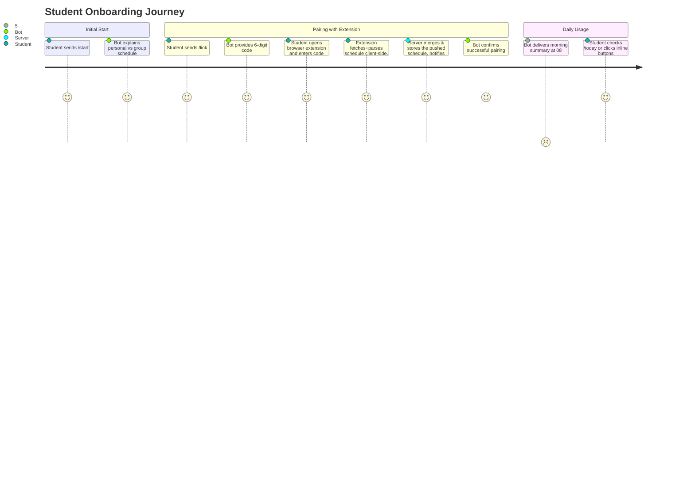

# Telegram Bot Architecture & User Experience

> **Runtime note.** The bot is **not a separate service**. It runs inside the single Go backend (`apps/server/internal/bot/`, using `gotgbot/v2`) and shares its process, database, cache, and scheduler. Updates arrive via webhook (`POST /api/v1/telegram/webhook`) in production and via long polling in local development. See [`docs/project-repository.md` §4.1](../project-repository.md) for the rationale.

## 1. Bot Purpose & Features

The Telegram Bot provides students with quick, frictionless access to their verified daily and weekly schedules. It combines:
- **Interactive Inline Buttons**: Seamless switching between Days, Weeks, and Disciplines.
- **Smart Enrichments**: Direct links to campus buildings/rooms (`https://kpi.ua/k-5`) and lecturer profiles.
- **Morning Briefings**: Configurable automated reminders before the first class of the day.
- **Stale Schedule Alerts**: Notification if the browser extension hasn't pushed an update in a while — there is no server-side session to expire any more, see [`docs/architecture/data-storage.md`](../architecture/data-storage.md) §4.

---

## 2. Command Reference

| Command | Action Description |
| :--- | :--- |
| `/start` | Welcome guide, onboarding instructions, and main menu. |
| `/link` | Generates a 6-digit one-time code for Browser Extension pairing. |
| `/today` | Shows today's classes with locations and teacher names. |
| `/tomorrow` | Shows tomorrow's classes. |
| `/week` | Shows the full timetable for the current academic week (Week 1 or Week 2). |
| `/group` | Set or change the academic group (e.g. `ІП-21`). |
| `/settings` | Manage morning reminders, timezone, and account linking status. |
| `/help` | FAQ, troubleshooting, and links to web extension. |

---

## 3. Message Layout Examples

### 3.1 Daily Schedule View (`/today`)

```text
📅 Розклад на сьогодні (Вівторок, 1 вересня)
🔹 1-й тиждень (Чисельник) | Група: ІП-21

1️⃣ 08:30 — 10:05 | Лекція
📖 Процеси розробки вбудованого ПЗ
👨‍🏫 Гуменний Д. О.
📍 Аудиторія: 18-402 (Корпус 18)

2️⃣ 10:25 — 12:00 | Практика [Вибіркова]
📖 Технології DevOps
👨‍🏫 Колумбет В. П.
📍 Аудиторія: 5-508 (Корпус 5)

[ ◀️ Вчора ]  [ 🔄 Оновити ]  [ Завтра ▶️ ]
[ 🗓 Розклад на тиждень ]
```

---

## 4. Onboarding User Journey



---

## 5. Inline Navigation & Message Mutation

The day/week navigation buttons (`◀️ Вчора` / `🔄 Оновити` / `Завтра ▶️`) **edit the existing message in place** rather than sending a new one, so the chat is never flooded. This uses:

| Purpose | Bot API method |
| :--- | :--- |
| Replace the schedule text and buttons | `editMessageText` |
| Replace only the keyboard | `editMessageReplyMarkup` |
| Remove a message | `deleteMessage` |
| Stop the button's loading spinner | `answerCallbackQuery` |

**Storage implication**: a callback update already carries `callback_query.message.message_id` and the chat ID, so ordinary navigation requires **no persisted message state**. A `message_id` only needs to be stored when the server must edit a message *later and unprompted* — for example, amending the morning briefing if a class is cancelled.

---

## 6. Automated Background Worker

The server runs an in-process scheduler (`apps/server/internal/scheduler/`):
- **Morning Reminder Worker**: Fires every morning (e.g. at 07:30 or 08:00) for opted-in users who have classes scheduled on that day.
- **Stale Schedule Check Worker**: Periodically checks `user_schedule_state.refreshed_at` and alerts users gracefully to re-sync the extension if it's gone stale (see [`docs/architecture/data-storage.md`](../architecture/data-storage.md) §4) — there are no session cookies to validate any more, only a push timestamp to watch.

Per-user reminders are **not** individual cron entries. A single short-interval tick drains a table of due reminders (outbox pattern), so pending notifications survive restarts and redeploys.

Sending a reminder is a plain outbound HTTPS call to `api.telegram.org`, independent of whether updates are delivered by webhook or long polling.
