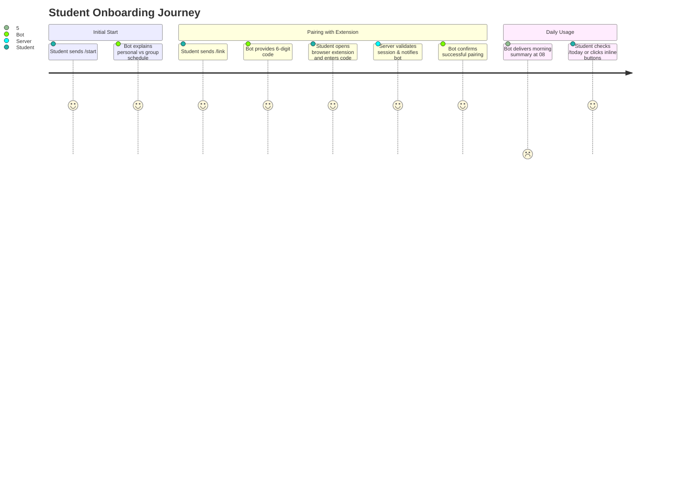

# Telegram Bot Architecture & User Experience

## 1. Bot Purpose & Features

The Telegram Bot provides students with quick, frictionless access to their verified daily and weekly schedules. It combines:
- **Interactive Inline Buttons**: Seamless switching between Days, Weeks, and Disciplines.
- **Smart Enrichments**: Direct links to campus buildings/rooms (`https://kpi.ua/k-5`) and lecturer profiles.
- **Morning Briefings**: Configurable automated reminders before the first class of the day.
- **Session Health Alerts**: Immediate notification if the student's `my.kpi.ua` session expires.

---

## 2. Command Reference

| Command | Action Description |
| :--- | :--- |
| `/start` | Welcome guide, onboarding instructions, and main menu. |
| `/link` | Generates a 6-digit one-time code for Browser Extension pairing. |
| `/today` | Shows today's classes with locations and teacher names. |
| `/tomorrow` | Shows tomorrow's classes. |
| `/week` | Shows the full timetable for the current academic week (Week 1 or Week 2). |
| `/group` | Set or change the academic group (e.g. `ІП-21`). |
| `/settings` | Manage morning reminders, timezone, and account linking status. |
| `/help` | FAQ, troubleshooting, and links to web extension. |

---

## 3. Message Layout Examples

### 3.1 Daily Schedule View (`/today`)

```text
📅 Розклад на сьогодні (Вівторок, 1 вересня)
🔹 1-й тиждень (Чисельник) | Група: ІП-21

1️⃣ 08:30 — 10:05 | Лекція
📖 Процеси розробки вбудованого ПЗ
👨‍🏫 Гуменний Д. О.
📍 Аудиторія: 18-402 (Корпус 18)

2️⃣ 10:25 — 12:00 | Практика [Вибіркова]
📖 Технології DevOps
👨‍🏫 Колумбет В. П.
📍 Аудиторія: 5-508 (Корпус 5)

[ ◀️ Вчора ]  [ 🔄 Оновити ]  [ Завтра ▶️ ]
[ 🗓 Розклад на тиждень ]
```

---

## 4. Onboarding User Journey



---

## 5. Automated Background Worker

The bot backend runs a scheduled cron daemon:
- **Morning Reminder Worker**: Fires every morning (e.g. at 07:30 or 08:00) for opted-in users who have classes scheduled on that day.
- **Session Keep-Alive / Check Worker**: Periodically checks the validity of stored session cookies and alerts users gracefully if re-sync is required.
