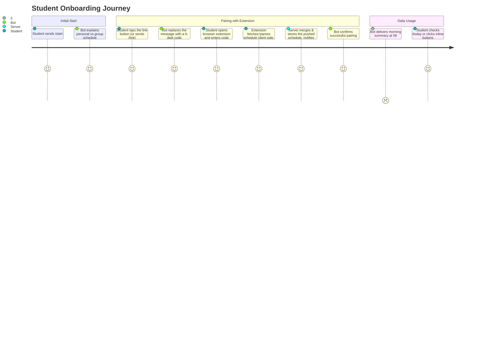

# Telegram Bot Architecture & User Experience

> **Runtime note.** The bot is **not a separate service**. It runs inside the single Go backend (`apps/server/internal/bot/`, using `gotgbot/v2`) and shares its process, database, cache, and scheduler. It calls `internal/api.Service` and `internal/storage.DB` directly, in-process — not over HTTP with `X-Internal-Token`, even though the `/api/v1/auth/pair/generate` and `/api/v1/schedule/*` endpoints exist and are internal-token-protected for other internal/admin callers. Updates arrive via webhook (`POST /api/v1/telegram/webhook`), authenticated by `secret_token` via the `X-Telegram-Bot-Api-Secret-Token` header and exempt from IP rate limiting (see `docs/architecture/error-handling-resilience.md` §5). Both local development (via ngrok/tunnel) and production use webhooks — no long polling is used. See [`docs/project-repository.md` §4.1](../project-repository.md) for the rationale.
>
> **Implementation status.** `/start`, `/link`, `/today`, and `/week` are implemented, all four as button screens that edit the message in place. `/tomorrow`, `/group`, `/settings`, `/help`, morning reminders, and the stale-schedule background check are **not implemented yet** — see §6.

## 1. Bot Purpose & Features

The Telegram Bot provides students with quick, frictionless access to their verified daily and weekly schedules. It combines:
- **Interactive Inline Buttons**: Seamless switching between Days, Weeks, and Disciplines.
- **Smart Enrichments**: Direct links to campus buildings/rooms (`https://kpi.ua/k-5`) and lecturer profiles.
- **Morning Briefings**: Configurable automated reminders before the first class of the day.
- **Stale Schedule Alerts**: Notification if the browser extension hasn't pushed an update in a while — there is no server-side session to expire any more, see [`docs/architecture/data-storage.md`](../architecture/data-storage.md) §4.

---

## 2. Command Reference

| Command | Status | Action Description |
| :--- | :--- | :--- |
| `/start` | ✅ Implemented | Onboarding screen: extension prerequisite + a button that swaps the message over to the pairing code; notes an existing sync and offers a direct schedule button when one is fresh (see §3.3). |
| `/link` | ✅ Implemented | Generates a 6-digit one-time code for Browser Extension pairing — the same screen the `/start` button leads to. |
| `/urls` | ✅ Implemented | Interactive menu to manage custom lesson conference URLs (Zoom, Meet, etc.) with prompt-and-delete chat flow (see §3.4). |
| `/today` | ✅ Implemented | Shows today's classes with locations and teacher names, with ◀️ Вчора / 📅 Сьогодні / Завтра ▶️ inline day-navigation. |
| `/week` | ✅ Implemented | Shows one academic week compactly, with previous/current/next week slots and a jump to today (see §3.2). |
| `/tomorrow` | Not yet built | Shows tomorrow's classes. |
| `/group` | Not yet built | Set or change the academic group (e.g. `ІП-21`). |
| `/settings` | Not yet built | Manage morning reminders, timezone, and account linking status. |
| `/help` | Not yet built | FAQ, troubleshooting, and links to web extension. |

---

## 3. Message Layout Examples

### 3.1 Daily Schedule View (`/today`)

```text
📅 Розклад на 02.09 (Вівторок)

08:30 Процеси розробки вбудованого ПЗ [Лек., Оффлайн]
Викладач: Гуменний Д. О.

10:25 Технології DevOps [Практ., Онлайн]    ← clickable link if URL added
Викладач: Колумбет В. П.

[ ◀️ Вчора ]  [ 📅 Сьогодні ]  [ Завтра ▶️ ]
```

(`02.09`, `Викладач:`, and the time are HTML `<b>`/`<code>` — plain-text here for readability.)

The middle button jumps back to the current day from wherever navigation has wandered
to. There is no separate "refresh" button: every render re-reads storage, so the data is
always fresh — tapping 📅 Сьогодні while already on today is the refresh. The date is
day/month only (no year) and the week/group summary row is gone entirely — a student
already knows their own group, and the parity shows up on the `/week` screen. The
room/online-meeting detail is formatted as `[Лек.|Практ., Онлайн|Оффлайн]`: when a URL
is available for this online lesson, the text is wrapped with an HTML link `<a href="...">...</a>`
so students can tap it directly to join.

### 3.2 Weekly Schedule View (`/week`)

One academic week at a time, deliberately compact (one line per lesson — a full per-lesson
block for six days would not fit a Telegram message):

```text
🗓 Перший тиждень — Поточний
Група: ІП-21

▎Понеділок
10:25 Практичний курс іноземної мови. Частина 1 [Лек., Онлайн]
12:20 Компоненти програмної інженерії. Частина 4 [Лек., Онлайн]

▎Середа - Сьогодні
08:30 Процеси розробки вбудованого ПЗ [Практ., Оффлайн]
16:10 Основи розробки трансляторів [Практ., Онлайн]

[ ◀️ Минулий ]  [ ✅ Поточний ]  [ Наступний ▶️ ]
[ 📅 Розклад на сьогодні ]
```

("Перший"/"Другий", "Група:", and the lesson time are HTML `<b>`/`<code>`; the day header
(`▎…`) is a native Telegram `<blockquote>` — plain-text approximations here for
readability.)

Each lesson displays its `[Лек.|Практ., Онлайн|Оффлайн]` tag, wrapping it in an HTML link
whenever a custom URL is stored.

The three week buttons are **fixed slots** relative to the real current week (offsets −1,
0, +1), not steps relative to what is on screen — so navigation never drifts further than
one week out from today. Telegram has no disabled-button state, so the slot currently being
displayed renders as a marked, inert button (`✅ …`, callback `week:noop`) instead of being
removed, keeping the row's shape stable. Days are marked *- Сьогодні*/*- Завтра* only in the
current week (offset 0), where those labels can actually apply; the parenthetical
Чисельник/Знаменник label is dropped from the header — bolding just the ordinal word carries
the same information with far less noise.

### 3.3 Onboarding screens (`/start` → `/link`)

Two screens inside a single message, edited in place:

```text
👋 Вітаю! …
Спочатку встанови браузерне розширення — інструкція буде тут пізніше.   ← placeholder
✅ Твій розклад уже синхронізовано …                                     ← only if synced
[ 🔗 Прив'язати акаунт ]
[ 📅 Розклад на сьогодні ]                                               ← only if fresh

        ↓ (same message, edited)

🔑 Код прив'язки: 123-456 …
[ ◀️ Назад ]  [ 🗓 Показати розклад ]
```

`◀️ Назад` returns to the start screen; `🗓 Показати розклад` moves forward into the `/week`
view. The schedule screens (§3.1, §3.2) deliberately have **no route back** to onboarding —
it is a one-way path.

The start screen is **state-aware** (`Service.ScheduleFreshness`, no network calls), but only
additively — the onboarding text and the link button are present in every state, so
re-pairing is always possible:

| State | Extra note | Extra button |
| :--- | :--- | :--- |
| No schedule pushed yet | — | — |
| Pushed, but stale | ⚠️ synced, but may be outdated — sync again | — |
| Pushed and fresh | ✅ already synced | `📅 Розклад на сьогодні` |

`◀️ Назад` re-evaluates this state rather than restoring a snapshot, so a student who pairs
the extension in another tab and then goes back sees the updated screen.

### 3.4 Lesson URLs Interactive Menu (`/urls`)

Allows students to associate video conference links (Zoom, Google Meet, Teams, etc.) with their
online lessons.

#### Key Principles:
1. **Deduplication & Refresh Resilience**:
   - Identical lessons are grouped across the entire semester by `(subject_norm, tag)`.
   - Lectures (`tag: "lec"`) and practices (`tag: "prac"`) are distinct items with separate URLs.
   - URLs are stored in a dedicated table (`user_lesson_urls`), so they survive full schedule
     re-syncs and replacements from the browser extension.
2. **Offline Exclusion**:
   - Classes determined to be in-person/offline (`[... , Оффлайн]`) are excluded from the editable
     lessons menu.
3. **Zero Chat Pollution (Auto-Deletion)**:
   - When a student taps a lesson button, the interactive menu message edits in-place to prompt for the URL.
   - Any message the user sends during this active prompt is **immediately deleted** via `deleteMessage`
     (in both success and error cases), keeping the chat completely clean.
4. **Validation & Inline Error Handling**:
   - URLs are trimmed and validated (`http`/`https`, host domain, URI parsing).
   - If invalid, the prompt message updates in place with an error notice and asks for a valid URL,
     offering a `[ ◀️ Назад ]` button to cancel.
   - If valid, the URL is saved, the active prompt is cleared, and the message edits back to the
     lesson selection list with a confirmation banner.
   - An existing URL can also be removed via `[ 🗑 Видалити посилання ]`.

```text
🔗 Посилання на онлайн-заняття

• Технології DevOps [Лек., Онлайн] (https://zoom.us/...)
• Технології DevOps [Практ., Онлайн]

Обери заняття зі списку нижче, щоб додати або змінити посилання:

[ 🔗 Технології DevOps (Лек.) ]
[ ➕ Технології DevOps (Практ.) ]
[ 📅 До розкладу ]

        ↓ (tapped a lesson, message edited in-place)

🔗 Технології DevOps [Лек., Онлайн]
Поточне посилання: https://zoom.us/...

Надішли посилання на це заняття (Zoom, Google Meet тощо):

[ 🗑 Видалити посилання ]
[ ◀️ Назад ]
```

---

## 4. Onboarding User Journey



---

## 5. Inline Navigation & Message Mutation

Every button in the bot — onboarding, day navigation, week navigation — **edits the existing message in place** rather than sending a new one, so the chat is never flooded. Only typed commands (`/start`, `/link`, `/today`, `/week`) post a new message, since there is nothing on screen to edit yet. This uses:

| Purpose | Bot API method |
| :--- | :--- |
| Replace the schedule text and buttons | `editMessageText` |
| Replace only the keyboard | `editMessageReplyMarkup` |
| Remove a message | `deleteMessage` |
| Stop the button's loading spinner | `answerCallbackQuery` |

Each screen namespaces its buttons with its own `callback_data` prefix — `menu:` (onboarding), `nav:` (day), `week:` (week) — so one dispatcher handler is registered per screen instead of one that demultiplexes every button in the bot.

**Storage implication**: a callback update already carries `callback_query.message.message_id` and the chat ID, so ordinary navigation requires **no persisted message state**. A `message_id` only needs to be stored when the server must edit a message *later and unprompted* — for example, amending the morning briefing if a class is cancelled.

---

## 6. Automated Background Worker

> **Not implemented yet.** `apps/server/internal/scheduler/` does not exist yet, and there is
> no DB table backing per-user reminder settings or an outbox of due reminders either. The
> design below is the target shape.

The server runs an in-process scheduler (`apps/server/internal/scheduler/`):
- **Morning Reminder Worker**: Fires every morning (e.g. at 07:30 or 08:00) for opted-in users who have classes scheduled on that day.
- **Stale Schedule Check Worker**: Periodically checks `user_schedule_state.refreshed_at` and alerts users gracefully to re-sync the extension if it's gone stale (see [`docs/architecture/data-storage.md`](../architecture/data-storage.md) §4) — there are no session cookies to validate any more, only a push timestamp to watch.

Per-user reminders are **not** individual cron entries. A single short-interval tick drains a table of due reminders (outbox pattern), so pending notifications survive restarts and redeploys.

Sending a reminder is a plain outbound HTTPS call to `api.telegram.org`.
