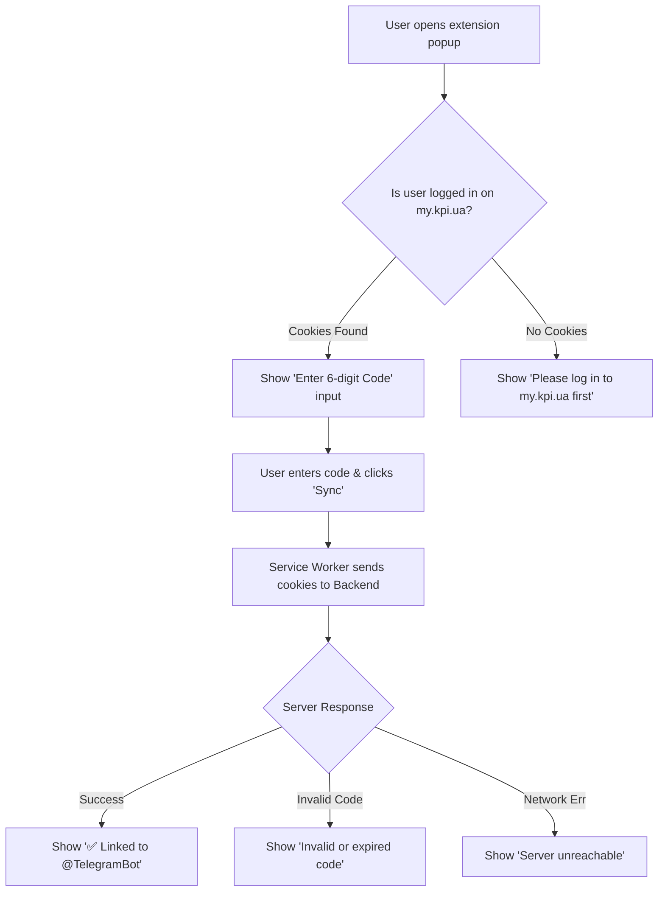

# Browser Extension Architecture & Design (Manifest V3)

## 1. Overview & Objective

The **KPI Schedule Sync Extension** is a lightweight browser extension built with **WebExtensions Manifest V3** standards. Its single responsibility is to safely read the student's active authentication cookies from `https://my.kpi.ua` and synchronize them with the backend server using a one-time pairing code.

---

## 2. Manifest V3 Configuration (`manifest.json`)

```json
{
  "manifest_version": 3,
  "name": "KPI Schedule Sync",
  "version": "1.0.0",
  "description": "Синхронізація персонального розкладу My KPI з Telegram-ботом",
  "icons": {
    "16": "icons/icon-16.png",
    "48": "icons/icon-48.png",
    "128": "icons/icon-128.png"
  },
  "action": {
    "default_popup": "popup/popup.html",
    "default_title": "KPI Schedule Sync"
  },
  "permissions": [
    "cookies",
    "storage"
  ],
  "host_permissions": [
    "https://my.kpi.ua/*",
    "https://*.kpi.ua/*",
    "http://localhost:8080/*"
  ],
  "background": {
    "service_worker": "background/service_worker.js"
  }
}
```

---

## 3. Extension Architecture & Files

```text
extension/
├── manifest.json                  # Manifest V3 metadata & permissions
├── popup/
│   ├── popup.html                 # Extension UI modal
│   ├── popup.css                  # Modern minimal styling
│   └── popup.js                   # UI event handling & user feedback
├── background/
│   └── service_worker.js          # Cookie extraction & backend sync network handler
└── icons/
    ├── icon-16.png
    ├── icon-48.png
    └── icon-128.png
```

---

## 4. Extension UI & User Flow



---

## 5. Security Principles

1. **Least Privilege Permissions**:
   - `host_permissions` are strictly confined to `my.kpi.ua` and the backend server.
   - The extension never accesses browsing history, bookmarks, or other website data.
2. **Local Processing**:
   - Cookies are never transmitted to third parties or analytics services.
3. **Open Source & Auditable**:
   - The extension consists of transparent, unminified JavaScript located in the `extension/` directory.
