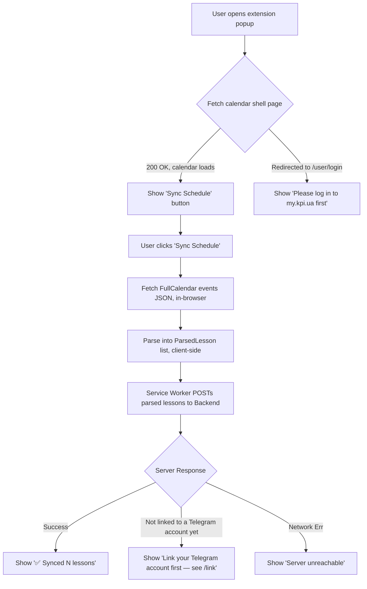

# Browser Extension Architecture & Design (Manifest V3)

> **Correction (post-implementation, architecture decision).** The extension's responsibility
> changed: it no longer relays `my.kpi.ua` session cookies to the backend at all. Instead it
> performs the whole fetch-and-parse of the personal schedule **client-side**, in the
> student's own browser session, and sends only the resulting parsed lesson list to the
> backend. See [`docs/architecture/data-storage.md`](../architecture/data-storage.md) for the
> rationale (no credential storage on the server) and
> [`docs/schedules/main/data-extraction.md`](../schedules/main/data-extraction.md) for the
> exact two-step fetch (shell page → FullCalendar events JSON) this document's flows now
> replicate client-side. **Not implemented yet** — this document describes the target design.

## 1. Overview & Objective

The **KPI Schedule Sync Extension** is a lightweight browser extension built with **WebExtensions Manifest V3** standards in **TypeScript**. Its responsibility is to fetch and parse the student's personal schedule from `https://my.kpi.ua`, using the browser's own already-authenticated session, and push the parsed lesson list to the backend server. Raw session cookies never leave the browser.

---

## 2. Manifest V3 Configuration (`manifest.json`)

```json
{
  "manifest_version": 3,
  "name": "KPI Schedule Sync",
  "version": "1.0.0",
  "description": "Синхронізація персонального розкладу My KPI з Telegram-ботом",
  "icons": {
    "16": "icons/icon-16.png",
    "48": "icons/icon-48.png",
    "128": "icons/icon-128.png"
  },
  "action": {
    "default_popup": "popup/popup.html",
    "default_title": "KPI Schedule Sync"
  },
  "permissions": [
    "storage"
  ],
  "host_permissions": [
    "https://my.kpi.ua/*",
    "http://localhost:8080/*"
  ],
  "background": {
    "service_worker": "background/service_worker.js"
  }
}
```

No `cookies` permission is requested. The service worker fetches `my.kpi.ua` with
`credentials: "include"` (covered by the `host_permissions` grant), so the browser attaches
the student's existing session automatically — the extension never reads or inspects the
cookie values themselves.

---

## 3. Extension Architecture & Files

> **Status: provisional.** This layout is the expected structure, not a frozen contract; it may change during implementation. Keep it in sync with [`docs/project-repository.md`](../project-repository.md).

Built with **TypeScript**, bundled by **Vite + `@crxjs/vite-plugin`**, with **Bun** as the package manager. The `manifest.json` shown in §2 is *generated* at build time from `manifest.config.ts` rather than hand-maintained.

```text
apps/extension/
├── manifest.config.ts             # Typed manifest source (@crxjs generates manifest.json)
├── vite.config.ts                 # Vite + @crxjs build configuration
├── package.json                   # Bun-managed dependencies
├── tsconfig.json
├── src/
│   ├── popup/
│   │   ├── popup.html             # Extension UI modal
│   │   ├── popup.css              # Modern minimal styling
│   │   └── popup.ts               # UI event handling & user feedback
│   └── background/
│       ├── fetch-schedule.ts      # Replicates the shell-page → events-JSON two-step fetch
│       ├── parse-schedule.ts      # Parses the FullCalendar JSON into the ParsedLesson shape
│       └── service-worker.ts      # Orchestrates fetch → parse → sync-to-backend
└── public/icons/
    ├── icon-16.png
    ├── icon-48.png
    └── icon-128.png
```

---

## 4. Extension UI & User Flow



The pairing mechanism that ties a browser (and its extension install) to a specific
Telegram account — a one-time code from `/link`, a signed extension-install token, or
something else — is not yet designed; it's a prerequisite for the "Not linked" branch above
but out of scope for this document until the server-side ingestion endpoint exists (see
[`docs/architecture/data-storage.md`](../architecture/data-storage.md) §4).

---

## 5. Security Principles

1. **Least Privilege Permissions**:
   - `host_permissions` are strictly confined to `my.kpi.ua` and the backend server.
   - No `cookies` permission — the extension never reads raw session cookie values, only
     relies on the browser attaching them automatically to same-session requests.
   - The extension never accesses browsing history, bookmarks, or other website data.
2. **Nothing Sensitive Leaves the Browser**:
   - The only network call to the backend is the parsed lesson list (subjects, times,
     dates, plain-text teacher/location strings) — never a cookie, token, or credential.
3. **Open Source & Auditable**:
   - The extension is fully open source; its TypeScript sources live in `apps/extension/src/` and the production bundle is built with source maps so it can be audited against them.
