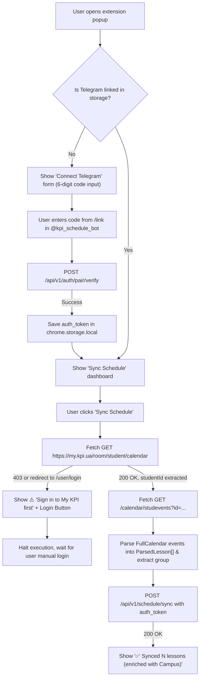

# Browser Extension Architecture & Design (Manifest V3)

> **Implementation status: Implemented.** The browser extension performs client-side schedule extraction from `my.kpi.ua`, handles Telegram account ownership verification via single-use 6-digit pairing codes from the bot, detects unauthenticated/403 states with login redirects, parses FullCalendar events into normalized `ParsedLesson` records, and pushes them to the Go backend `POST /api/v1/schedule/sync`.

---

## 1. Overview & Objective

The **KPI Schedule Sync Extension** is a lightweight browser extension built with **WebExtensions Manifest V3** standards in **TypeScript** and bundled with **Vite** using **Bun**. Its responsibility is to fetch and parse the student's personal schedule from `https://my.kpi.ua`, using the browser's own already-authenticated session (`credentials: "include"`), and push the parsed lesson list to the backend server. Raw session cookies never leave the browser.

---

## 2. Manifest V3 Configuration (`public/manifest.json`)

```json
{
  "manifest_version": 3,
  "name": "KPI Schedule Sync",
  "version": "1.0.0",
  "description": "Синхронізація розкладу My KPI з Telegram-ботом",
  "icons": {
    "16": "icons/icon-16.png",
    "48": "icons/icon-48.png",
    "128": "icons/icon-128.png"
  },
  "action": {
    "default_popup": "src/popup/popup.html",
    "default_title": "KPI Schedule Sync",
    "default_icon": {
      "16": "icons/icon-16.png",
      "48": "icons/icon-48.png",
      "128": "icons/icon-128.png"
    }
  },
  "permissions": [
    "storage"
  ],
  "host_permissions": [
    "https://my.kpi.ua/*",
    "https://api.campus.kpi.ua/*",
    "http://localhost:8080/*",
    "http://127.0.0.1:8080/*"
  ],
  "background": {
    "service_worker": "background/service-worker.js",
    "type": "module"
  }
}
```

No `cookies` permission is requested or needed. The extension fetches `my.kpi.ua` with `credentials: "include"`, so the browser attaches the student's existing session automatically.

---

## 3. Extension Project Structure (`apps/extension/`)

```text
apps/extension/
├── package.json                   # Bun scripts & dependencies (Vite, TypeScript, @types/chrome)
├── tsconfig.json                  # Strict TypeScript configuration
├── vite.config.ts                 # Multi-input build configuration (popup + background)
├── generate-icons.ts              # Script to produce pixel-perfect PNG icons
├── public/
│   ├── manifest.json              # Manifest V3 source
│   └── icons/
│       ├── icon-16.png            # 16x16 icon
│       ├── icon-48.png            # 48x48 icon
│       └── icon-128.png           # 128x128 icon
└── src/
    ├── types/
    │   └── index.ts               # Domain types (ParsedLesson, ScheduleSyncRequest, etc.)
    ├── lib/
    │   ├── storage.ts             # chrome.storage.local wrapper
    │   ├── fetch-schedule.ts      # Two-step fetch with 403 / login redirect detection
    │   ├── parse-schedule.ts      # FullCalendar JSON parser & tag/teacher normalizer
    │   ├── parse-schedule.test.ts # Bun unit tests for parser & normalizer
    │   └── api-client.ts          # Backend API client (/api/v1/auth/pair/verify, /api/v1/schedule/sync)
    ├── background/
    │   └── service-worker.ts      # Background service worker
    └── popup/
        ├── popup.html             # Multi-state responsive popup UI
        ├── popup.css              # KPI-styled theme, spinner, badges, and alerts
        └── popup.ts               # State controller, pairing validator, sync orchestrator
```

---

## 4. Extension UI & User Flow



---

## 5. Security Principles

1. **Telegram Ownership Verification**:
   - Pairing requires a 6-digit numeric single-use code with a 10-minute TTL generated exclusively by the student's own Telegram bot session (`/link`).
   - Prevents unauthorized users from pushing schedules to other students' Telegram accounts.
2. **Least Privilege Permissions**:
   - `permissions`: strictly `["storage"]`.
   - `host_permissions`: strictly confined to `my.kpi.ua`, `api.campus.kpi.ua`, and the backend server.
   - No `cookies`, `tabs`, `activeTab`, or `<all_urls>` permissions.
3. **Zero Sensitive Data Transmission**:
   - The extension only pushes the parsed, sanitized lesson schedule. Passwords, session cookies, and login credentials never leave the browser.

---

## 6. Distribution & Installation

### 6.1 Packaging (`scripts/pack.ts`)
The extension bundle is built and zipped via:
```bash
bun run build:zip
```
This runs `vite build` into `dist/` and executes `scripts/pack.ts`, creating a clean `dist/kpi-schedule-sync.zip` without external zip dependencies.

### 6.2 Distribution Channels
1. **Server Ingestion / Direct Download**:
   - The backend server serves the pre-built archive directly at `GET /api/v1/extension/download`.
   - The Telegram bot provides an inline button linking directly to this download URL (or `EXTENSION_DOWNLOAD_URL` if an external release asset or CDN is configured).
2. **Developer Mode Sideloading (Chrome / Edge / Brave / Opera)**:
   - Students download and extract `kpi-schedule-sync.zip`.
   - Navigate to `chrome://extensions` (or `edge://extensions`).
   - Toggle **Developer mode** (*Режим розробника*) ON.
   - Click **Load unpacked** (*Завантажити розпаковане розширення*) and select the unzipped directory.
3. **Chrome Web Store Publication**:
   - Store listing metadata, justifications, and disclosures are fully prepared in [`CHROMEWEBSTORE.md`](../../CHROMEWEBSTORE.md) for single-click web store installation.
