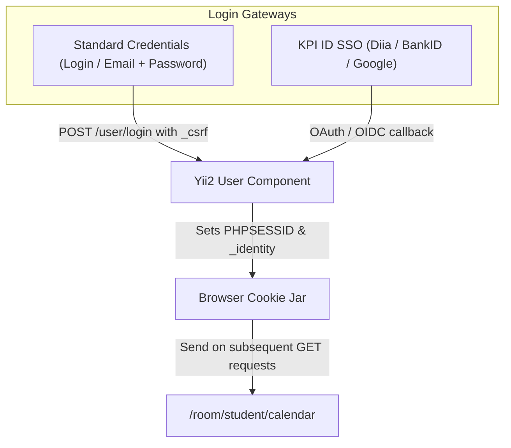

# my.kpi.ua Authentication & Session Mechanism

## 1. Authentication Architecture

`my.kpi.ua` utilizes the standard session and identity architecture provided by the **Yii2 PHP Framework**.

Unlike modern SPAs that store a JSON Web Token (JWT) in `localStorage`, `my.kpi.ua` relies on **HTTP Cookies** for user identification and session state:

```text
+--------------------+---------------------------------------------------------------+
| Cookie Name        | Description & Purpose                                         |
+--------------------+---------------------------------------------------------------+
| PHPSESSID          | Active PHP session identifier (HttpOnly, Session lifetime)    |
| _identity          | Yii2 Remember-Me authentication cookie (Signed with HMAC)     |
| _csrf              | CSRF token cookie for validating state-changing form POSTs    |
| language           | UI language preference ("uk" or "en")                         |
+--------------------+---------------------------------------------------------------+
```

---

## 2. Authentication Methods on my.kpi.ua



### 2.1 Standard Form Login
- Route: `POST https://my.kpi.ua/user/login`
- Form Payload:
  - `_csrf`: CSRF token from `<meta name="csrf-token">` or hidden input.
  - `login-form[login]`: Student login or campus email.
  - `login-form[password]`: Password.
  - `login-form[rememberMe]`: `1` (ensures `_identity` persistent cookie is set).

### 2.2 KPI ID Single Sign-On
- Service: `https://auth.kpi.ua/` (script `https://cdn.cloud.kpi.ua/public/kpi-id-signin.js`).
- Allows login via government e-services (Diia, BankID) or Google.
- Once authenticated on `auth.kpi.ua`, the user is redirected back to `my.kpi.ua`, which initializes the `PHPSESSID` session.

---

## 3. Session Lifetime & Persistence

1. **Active Session (`PHPSESSID`)**: Typically expires after 20–60 minutes of inactivity or upon browser close if remember-me is not active.
2. **Persistent Identity (`_identity`)**: When "Remember Me" is enabled, Yii2 sets a persistent cookie valid for 30 days containing:
   - Serialized array: `[user_id, auth_key, duration]`
   - Cryptographic HMAC hash to prevent tampering.
3. **Session Refresh**: If `PHPSESSID` expires but `_identity` is provided, Yii2 automatically re-authenticates the user and spawns a fresh `PHPSESSID`.

---

## 4. Making Authenticated Requests from Golang

To request personal schedule data from the Go backend, the HTTP client must include both cookies in the request header:

```http
GET /room/student/calendar HTTP/1.1
Host: my.kpi.ua
User-Agent: Mozilla/5.0 (X11; Linux x86_64; rv:128.0) Gecko/20100101 Firefox/128.0
Accept: text/html,application/xhtml+xml,application/xml;q=0.9,*/*;q=0.8
Cookie: PHPSESSID=eb659e5b8a5f5a4ea1d4f20ef1443af9; _identity=...; language=...
```

If the cookies are invalid or expired, `my.kpi.ua` responds with:
- `HTTP 302 Found` with `Location: https://my.kpi.ua/user/login`, or
- `HTTP 403 Forbidden`.
