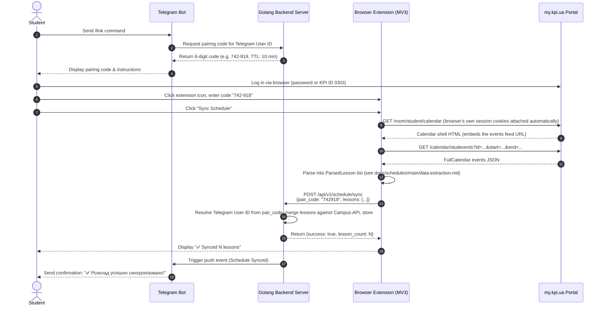

# Browser Extension Authentication Flow

> **Implementation status: Implemented.** The extension fetches and parses the schedule client-side, using the browser's own session (`fetch(..., { credentials: "include" })`, no `cookies` permission needed — see [`docs/extension/browser-extension-design.md`](../../extension/browser-extension-design.md)), and sends the parsed lesson list to the server. Telegram account pairing uses single-use 6-digit numeric codes generated via `POST /api/v1/auth/pair/generate` (by the Telegram bot) and verified via `POST /api/v1/auth/pair/verify` or directly with `POST /api/v1/schedule/sync`.

## 1. Overview

Because `my.kpi.ua` uses HTTP-only session cookies without a public OAuth API, the **Browser Extension** is the only component that can read the student's personal schedule — it does so inside their own authenticated browser session, then bridges the result to their Telegram Bot account.

---

## 2. Sync Flow (target design)



The pairing-code mechanic (steps 1–4) is carried over unchanged in shape from the original
design — a short-lived code from `/link` is still the most plausible way to tie a browser to
a Telegram account — but it is **not implemented**: there is no `pair_code` table, no
`/api/v1/schedule/sync` endpoint, and no Telegram bot yet. Treat this diagram as intent, not
a built contract.

---

## 3. Data Transferred from Extension

The extension sends only the already-parsed schedule — never a cookie, token, or password:

```json
{
  "pair_code": "742918",
  "lessons": [
    {
      "date": "2026-09-19",
      "start_time": "08:30:00",
      "end_time": "10:05:00",
      "subject": "Технології DevOps",
      "tag": "lec",
      "teacher_raw": "Колумбет В. П.",
      "location_raw": "lec., Онлайн Zoom"
    }
  ]
}
```

This mirrors `model.ParsedLesson` (`apps/server/internal/model/domain.go`) — see
[`docs/architecture/data-storage.md`](../../architecture/data-storage.md) §4 for the
envisioned request shape once the sync endpoint exists.

---

## 4. Security & Privacy Guarantees

1. **Short-Lived Pairing Codes**:
   - Pairing codes expire after 10 minutes and can only be used once.
   - Brute-force rate limiting: 5 attempts per IP / Telegram user before cooldown.

2. **Nothing Sensitive Ever Reaches the Server**:
   - No cookies, tokens, or passwords are ever transmitted. The server only ever receives
     the parsed lesson list, which is not a credential — there is nothing to encrypt at rest.

3. **No Password Stored**:
   - The user's actual password or SSO credentials are never seen or stored by the extension, bot, or server.

4. **Extension Isolation**:
   - The browser extension only requests `host_permissions` for `https://my.kpi.ua/*` and the backend origin. No `cookies` permission, no access to other tabs or websites.
