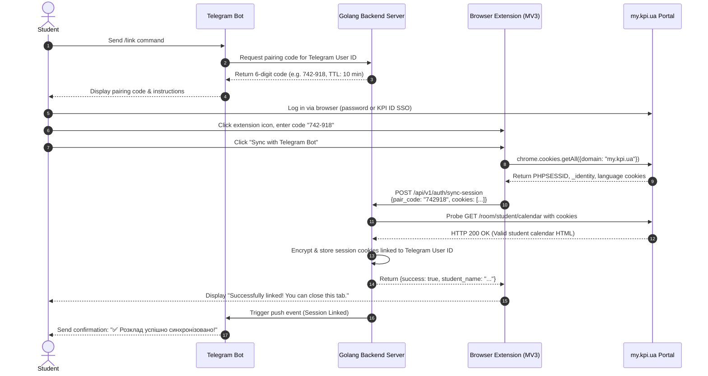

# Browser Extension Authentication Flow

## 1. Overview

Because `my.kpi.ua` uses HTTP-only and session cookies without a public OAuth API, the **Browser Extension** provides a seamless, secure, and user-friendly mechanism to bridge the student's browser session with their Telegram Bot account.

---

## 2. Authentication Handshake Protocol



---

## 3. Data Transferred from Extension

The extension collects only the necessary authentication parameters:

```json
{
  "pair_code": "742918",
  "domain": "my.kpi.ua",
  "cookies": {
    "PHPSESSID": "eb659e5b8a5f5a4ea1d4f20ef1443af9",
    "_identity": "39233868b6449f77b496598a9824806e3adf855c...",
    "language": "uk"
  },
  "user_agent": "Mozilla/5.0 (Windows NT 10.0; Win64; x64)..."
}
```

---

## 4. Security & Privacy Guarantees

1. **Short-Lived Pairing Codes**:
   - Pairing codes expire after 10 minutes and can only be used once.
   - Brute-force rate limiting: 5 attempts per IP / Telegram user before cooldown.

2. **At-Rest Encryption**:
   - Session cookies stored in the database are encrypted at rest using AES-256-GCM with a secret master key.

3. **No Password Stored**:
   - The user's actual password or SSO credentials are never seen or stored by the bot or server.

4. **Extension Isolation**:
   - The browser extension only requests access to `https://my.kpi.ua/*` cookies and domain. No access to other tabs or websites is requested.
