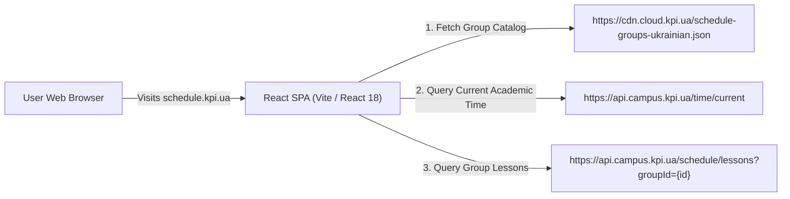

# Group Schedule Overview (schedule.kpi.ua & api.campus.kpi.ua)

## 1. Overview

The public schedule service for Igor Sikorsky Kyiv Polytechnic Institute is hosted at:
- **Web Interface**: `https://schedule.kpi.ua/`
- **Official Backend API**: `https://api.campus.kpi.ua/`
- **Open-Source Repository**: `https://github.com/kpi-ua/schedule.kpi.ua`

This service provides public, unauthenticated access to group schedules, lecturer schedules, exam schedules, and academic calendar metadata.

---

## 2. Architecture of schedule.kpi.ua

### Key Architectural Traits
1. **Zero Authentication Required**: All group, lecturer, and exam endpoints are publicly accessible via standard HTTP `GET` requests without API keys or authorization headers.
2. **Standardized JSON Responses**: The API returns clean, structured JSON, eliminating the need for HTML scraping.
3. **Cloud CDN for Static Lists**: The group list is served directly via a fast CDN cache (`cdn.cloud.kpi.ua`).

---

## 3. Role in the Personalized Platform

The Group Schedule is used as a **Rich Metadata Provider**:
- It supplies classroom room numbers and building maps (`location`).
- It supplies verified lecturer names and internal identifiers (`lecturer`).
- It supplies exact date lists (`dates: ["YYYY-MM-DD", ...]`) for periodic / bi-weekly / single-occurrence pairs.
- It supplies the official academic week number (`currentWeek`: 1 or 2) and day.

The Golang backend queries `api.campus.kpi.ua` directly to enrich the personal schedule.
